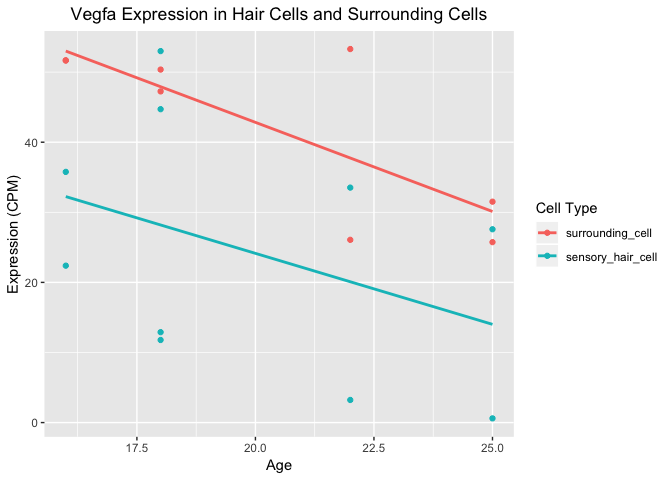

Analysis Assignment Part 1
================
Matthew Shannon
2019-02-23

------------------------------------------------------------------------

Dependencies
============

``` r
#install.packages("tidyverse", dependencies = TRUE)
#install.packages("reshape2", dependencies = TRUE)
#install.packages("knitr", dependencies = TRUE)
#install.packages("data.table", dependencies = TRUE)
#install.packages("dplyr", dependencies = TRUE)
#install.packages("plyr", dependencies = TRUE)
#install.packages("here", dependencies = TRUE)
#install.packages("gplots", dependencies = TRUE)
#install.packages("GGally", dependencies = TRUE)
#source("https://bioconductor.org/biocLite.R")
#biocLite("limma")
#biocLite("DESeq2")
#biocLite("edgeR")
#biocLite("qvalue")
library(tidyverse)
```

    ## ── Attaching packages ───────────────────────────────────────────────────────────── tidyverse 1.2.1 ──

    ## ✔ ggplot2 3.1.0       ✔ purrr   0.3.0  
    ## ✔ tibble  2.0.1       ✔ dplyr   0.8.0.1
    ## ✔ tidyr   0.8.2       ✔ stringr 1.4.0  
    ## ✔ readr   1.3.1       ✔ forcats 0.4.0

    ## ── Conflicts ──────────────────────────────────────────────────────────────── tidyverse_conflicts() ──
    ## ✖ dplyr::filter() masks stats::filter()
    ## ✖ dplyr::lag()    masks stats::lag()

``` r
library(reshape2)
```

    ## 
    ## Attaching package: 'reshape2'

    ## The following object is masked from 'package:tidyr':
    ## 
    ##     smiths

``` r
library(limma)
library(knitr)
library(data.table)
```

    ## 
    ## Attaching package: 'data.table'

    ## The following objects are masked from 'package:reshape2':
    ## 
    ##     dcast, melt

    ## The following objects are masked from 'package:dplyr':
    ## 
    ##     between, first, last

    ## The following object is masked from 'package:purrr':
    ## 
    ##     transpose

``` r
library(dplyr)
library(plyr)
```

    ## -------------------------------------------------------------------------

    ## You have loaded plyr after dplyr - this is likely to cause problems.
    ## If you need functions from both plyr and dplyr, please load plyr first, then dplyr:
    ## library(plyr); library(dplyr)

    ## -------------------------------------------------------------------------

    ## 
    ## Attaching package: 'plyr'

    ## The following objects are masked from 'package:dplyr':
    ## 
    ##     arrange, count, desc, failwith, id, mutate, rename, summarise,
    ##     summarize

    ## The following object is masked from 'package:purrr':
    ## 
    ##     compact

``` r
library(RColorBrewer)
library(cluster)
library(pvclust)
library(xtable)
library(lattice)
library(RCurl)
```

    ## Loading required package: bitops

    ## 
    ## Attaching package: 'RCurl'

    ## The following object is masked from 'package:tidyr':
    ## 
    ##     complete

``` r
library(GEOquery)
```

    ## Loading required package: Biobase

    ## Loading required package: BiocGenerics

    ## Loading required package: parallel

    ## 
    ## Attaching package: 'BiocGenerics'

    ## The following objects are masked from 'package:parallel':
    ## 
    ##     clusterApply, clusterApplyLB, clusterCall, clusterEvalQ,
    ##     clusterExport, clusterMap, parApply, parCapply, parLapply,
    ##     parLapplyLB, parRapply, parSapply, parSapplyLB

    ## The following object is masked from 'package:limma':
    ## 
    ##     plotMA

    ## The following objects are masked from 'package:dplyr':
    ## 
    ##     combine, intersect, setdiff, union

    ## The following objects are masked from 'package:stats':
    ## 
    ##     IQR, mad, sd, var, xtabs

    ## The following objects are masked from 'package:base':
    ## 
    ##     anyDuplicated, append, as.data.frame, basename, cbind,
    ##     colMeans, colnames, colSums, dirname, do.call, duplicated,
    ##     eval, evalq, Filter, Find, get, grep, grepl, intersect,
    ##     is.unsorted, lapply, lengths, Map, mapply, match, mget, order,
    ##     paste, pmax, pmax.int, pmin, pmin.int, Position, rank, rbind,
    ##     Reduce, rowMeans, rownames, rowSums, sapply, setdiff, sort,
    ##     table, tapply, union, unique, unsplit, which, which.max,
    ##     which.min

    ## Welcome to Bioconductor
    ## 
    ##     Vignettes contain introductory material; view with
    ##     'browseVignettes()'. To cite Bioconductor, see
    ##     'citation("Biobase")', and for packages 'citation("pkgname")'.

    ## Setting options('download.file.method.GEOquery'='auto')

    ## Setting options('GEOquery.inmemory.gpl'=FALSE)

``` r
library(pheatmap)
library(DESeq2)
```

    ## Loading required package: S4Vectors

    ## Loading required package: stats4

    ## 
    ## Attaching package: 'S4Vectors'

    ## The following object is masked from 'package:plyr':
    ## 
    ##     rename

    ## The following objects are masked from 'package:data.table':
    ## 
    ##     first, second

    ## The following objects are masked from 'package:dplyr':
    ## 
    ##     first, rename

    ## The following object is masked from 'package:tidyr':
    ## 
    ##     expand

    ## The following object is masked from 'package:base':
    ## 
    ##     expand.grid

    ## Loading required package: IRanges

    ## 
    ## Attaching package: 'IRanges'

    ## The following object is masked from 'package:plyr':
    ## 
    ##     desc

    ## The following object is masked from 'package:data.table':
    ## 
    ##     shift

    ## The following objects are masked from 'package:dplyr':
    ## 
    ##     collapse, desc, slice

    ## The following object is masked from 'package:purrr':
    ## 
    ##     reduce

    ## Loading required package: GenomicRanges

    ## Loading required package: GenomeInfoDb

    ## Loading required package: SummarizedExperiment

    ## Loading required package: DelayedArray

    ## Loading required package: matrixStats

    ## 
    ## Attaching package: 'matrixStats'

    ## The following objects are masked from 'package:Biobase':
    ## 
    ##     anyMissing, rowMedians

    ## The following object is masked from 'package:plyr':
    ## 
    ##     count

    ## The following object is masked from 'package:dplyr':
    ## 
    ##     count

    ## Loading required package: BiocParallel

    ## 
    ## Attaching package: 'DelayedArray'

    ## The following objects are masked from 'package:matrixStats':
    ## 
    ##     colMaxs, colMins, colRanges, rowMaxs, rowMins, rowRanges

    ## The following object is masked from 'package:purrr':
    ## 
    ##     simplify

    ## The following objects are masked from 'package:base':
    ## 
    ##     aperm, apply

``` r
library(edgeR)
library(qvalue)
library(here)
```

    ## here() starts at /Users/mattshannon/Desktop/STAT540/Seminars/STAT 540 Seminars

    ## 
    ## Attaching package: 'here'

    ## The following object is masked from 'package:plyr':
    ## 
    ##     here

``` r
library(gplots)
```

    ## 
    ## Attaching package: 'gplots'

    ## The following object is masked from 'package:IRanges':
    ## 
    ##     space

    ## The following object is masked from 'package:S4Vectors':
    ## 
    ##     space

    ## The following object is masked from 'package:stats':
    ## 
    ##     lowess

``` r
library(GGally)
```

    ## 
    ## Attaching package: 'GGally'

    ## The following object is masked from 'package:dplyr':
    ## 
    ##     nasa

Introduction
============

The assignment will analyze a dataset published by Scheffer et al. and used in their paper: **Gene Expression by Mouse Inner Ear Hair Cells during Development** published in the *Journal of Neuroscience* in 2015. The raw RNA-Seq reads have been submitted to GEO under the series ID [GSE60019](https://www.ncbi.nlm.nih.gov/geo/query/acc.cgi?acc=GSE60019), and information on the study can be found by reviewing the paper [here](https://www.ncbi.nlm.nih.gov/pubmed/25904789).

The transcriptomic data is found [here](data/gse60019_experiment_design.RDS).

The samples metadata is found [here](data/gse60019_expression_matrix.RDS).

As described [here](https://github.com/STAT540-UBC/STAT540-UBC.github.io/blob/master/homework/assignment/stat540_assignment_01_quality_control.md), raw reads have been mapped and processed into gene expression values using an established RNA-Seq pipeline at the [Pavlidis Lab](http://pavlab.msl.ubc.ca/) during data curation in [Gemma](https://gemma.msl.ubc.ca/expressionExperiment/showExpressionExperiment.html?id=9818). Expression values are given in Counts per Million (CPM). Quantile normalization has been done as part of the data processing pipeline.

------------------------------------------------------------------------

**Part One:** Data Inspection and Basic Manipulation
====================================================

### Question 1.1: Importing the Data and Gaining Familiarity

To begin, I will import the GSE60019 dataset published by Scheffer et al. I will be importing this dataset under the name: **expressionMatrix**.

``` r
expressionMatrix <- readRDS("gse60019_expression_matrix.tsv.RDS")
expressionMatrix <- expressionMatrix %>% as_tibble()
expressionMatrix
```

    ## # A tibble: 14,479 x 19
    ##    gene  GSM1463874 GSM1463872 GSM1463880 GSM1463879 GSM1463876 GSM1463877
    ##    <chr>      <dbl>      <dbl>      <dbl>      <dbl>      <dbl>      <dbl>
    ##  1 0610…     0.0522      0.528       1.45       3.46      0.800       1.48
    ##  2 0610…    14.1        13.7        33.0       30.6      37.2        31.4 
    ##  3 0610…   107.         16.2         3.80       4.68     17.9        15.2 
    ##  4 0610…     0.497       0.439       4.11       3.18      2.95        1.62
    ##  5 0610…     1.87        1.49        3.43       6.64      2.76        2.62
    ##  6 0610…    29.3        53.0         7.75      32.0      62.0        45.4 
    ##  7 0610…    87.1       196.         63.5       91.1      86.5        76.7 
    ##  8 0610…     4.34        8.69        4.81       6.28      2.71        4.01
    ##  9 0610…     4.87       12.5        19.6       14.7       9.88        9.45
    ## 10 0610…    10.5        11.3         3.91       4.36     12.8        10.6 
    ## # … with 14,469 more rows, and 12 more variables: GSM1463884 <dbl>,
    ## #   GSM1463882 <dbl>, GSM1463888 <dbl>, GSM1463886 <dbl>,
    ## #   GSM1463873 <dbl>, GSM1463871 <dbl>, GSM1463878 <dbl>,
    ## #   GSM1463875 <dbl>, GSM1463883 <dbl>, GSM1463881 <dbl>,
    ## #   GSM1463887 <dbl>, GSM1463885 <dbl>

Next, I will import the sample metadata that describes the samples. I will be importing this dataset under the name: **samplesMetadata**.

``` r
samplesMetadata <- readRDS("Gse60019_experiment_design.RDS")
samplesMetadata <- samplesMetadata %>% as_tibble()
names(samplesMetadata) <- c("sample_id", "organism_part", "cell_type", "time_point", "batch")
samplesMetadata
```

    ## # A tibble: 18 x 5
    ##    sample_id  organism_part              cell_type     time_point batch    
    ##    <chr>      <fct>                      <fct>         <fct>      <fct>    
    ##  1 GSM1463874 epithelium_of_utricle      sensory_hair… E16        HWI-EAS0…
    ##  2 GSM1463872 sensory_epithelium_of_spi… sensory_hair… E16        HWI-EAS0…
    ##  3 GSM1463880 epithelium_of_utricle      sensory_hair… P0         HWI-ST363
    ##  4 GSM1463879 epithelium_of_utricle      sensory_hair… P0         HWI-ST363
    ##  5 GSM1463876 sensory_epithelium_of_spi… sensory_hair… P0         HWI-ST363
    ##  6 GSM1463877 sensory_epithelium_of_spi… sensory_hair… P0         HWI-ST363
    ##  7 GSM1463884 epithelium_of_utricle      sensory_hair… P4         HWI-EAS0…
    ##  8 GSM1463882 sensory_epithelium_of_spi… sensory_hair… P4         HWI-EAS0…
    ##  9 GSM1463888 epithelium_of_utricle      sensory_hair… P7         HWI-EAS0…
    ## 10 GSM1463886 sensory_epithelium_of_spi… sensory_hair… P7         HWI-EAS0…
    ## 11 GSM1463873 epithelium_of_utricle      surrounding_… E16        HWI-EAS0…
    ## 12 GSM1463871 sensory_epithelium_of_spi… surrounding_… E16        HWI-EAS0…
    ## 13 GSM1463878 epithelium_of_utricle      surrounding_… P0         HWI-ST363
    ## 14 GSM1463875 sensory_epithelium_of_spi… surrounding_… P0         HWI-ST363
    ## 15 GSM1463883 epithelium_of_utricle      surrounding_… P4         HWI-EAS0…
    ## 16 GSM1463881 sensory_epithelium_of_spi… surrounding_… P4         HWI-EAS0…
    ## 17 GSM1463887 epithelium_of_utricle      surrounding_… P7         HWI-EAS0…
    ## 18 GSM1463885 sensory_epithelium_of_spi… surrounding_… P7         HWI-EAS0…

**How many genes are in the GSE60019 dataset?**

To determing this, I will identify the number of rows found in the dataset.

``` r
expressionMatrix %>% nrow()
```

    ## [1] 14479

Therefore, because there are 14479 rows in the dataest, this dataset contains 14479 genes.

**How many samples are in the GSE60019 dataset?**

To determing this, I will first identify the number of columns in the dataset.

This dataset contains a total of 19 columns. All of these columns describe samples except for one column which describes the genes in the data set. Because of this, the number of samples in the GSE60019 dataset is determined by n-1 columns.

``` r
expressionMatrix %>% ncol() - 1
```

    ## [1] 18

Therefore, this data set contains 18 samples.

To observe the number of factors present in the dataset as well as the number of levels per factor, I will list the structure of the dataset by running the following line of code:

``` r
str(samplesMetadata)
```

    ## Classes 'tbl_df', 'tbl' and 'data.frame':    18 obs. of  5 variables:
    ##  $ sample_id    : chr  "GSM1463874" "GSM1463872" "GSM1463880" "GSM1463879" ...
    ##  $ organism_part: Factor w/ 2 levels "epithelium_of_utricle",..: 1 2 1 1 2 2 1 2 1 2 ...
    ##  $ cell_type    : Factor w/ 2 levels "surrounding_cell",..: 2 2 2 2 2 2 2 2 2 2 ...
    ##  $ time_point   : Factor w/ 4 levels "E16","P0","P4",..: 1 1 2 2 2 2 3 3 4 4 ...
    ##  $ batch        : Factor w/ 3 levels "HWI-EAS00184",..: 2 2 3 3 3 3 2 2 1 2 ...

Therefore, as seen by observing the structure of the sample metadata, there are **4 factors**: Cell Type, Organism Part, Time Point, and Batch.

The Cell Type factor has **2** levels: *sensory hair cell* and *surrounding cell*.

The Organism Part factor has **2** levels: *sensory epithelium of spiral organ* and *epithelium of utricle*.

The Time Point factor has **4** levels: *E16*, *P0*, *P4*, and *P7*.

The Batch factor has **3** levels: *HWI-EAS00184*, *HWI-EAS00214*, and *HWI-ST363*.

### Question 1.2: Data Manipulation

Because the levels in the time point factor refer to points on a continous axis, I will convert this categorical variable to a numeric representation in a new column titled "age".

I will use the mutate() function (a dplyr verb) to acheive this column addition.

``` r
samplesMetadata <- samplesMetadata %>%
                   mutate (age = c(16, 16, 18, 18, 18, 18, 22, 22, 25, 25, 16, 16, 18, 18, 22, 22, 25, 25))
samplesMetadata
```

    ## # A tibble: 18 x 6
    ##    sample_id  organism_part          cell_type    time_point batch      age
    ##    <chr>      <fct>                  <fct>        <fct>      <fct>    <dbl>
    ##  1 GSM1463874 epithelium_of_utricle  sensory_hai… E16        HWI-EAS…    16
    ##  2 GSM1463872 sensory_epithelium_of… sensory_hai… E16        HWI-EAS…    16
    ##  3 GSM1463880 epithelium_of_utricle  sensory_hai… P0         HWI-ST3…    18
    ##  4 GSM1463879 epithelium_of_utricle  sensory_hai… P0         HWI-ST3…    18
    ##  5 GSM1463876 sensory_epithelium_of… sensory_hai… P0         HWI-ST3…    18
    ##  6 GSM1463877 sensory_epithelium_of… sensory_hai… P0         HWI-ST3…    18
    ##  7 GSM1463884 epithelium_of_utricle  sensory_hai… P4         HWI-EAS…    22
    ##  8 GSM1463882 sensory_epithelium_of… sensory_hai… P4         HWI-EAS…    22
    ##  9 GSM1463888 epithelium_of_utricle  sensory_hai… P7         HWI-EAS…    25
    ## 10 GSM1463886 sensory_epithelium_of… sensory_hai… P7         HWI-EAS…    25
    ## 11 GSM1463873 epithelium_of_utricle  surrounding… E16        HWI-EAS…    16
    ## 12 GSM1463871 sensory_epithelium_of… surrounding… E16        HWI-EAS…    16
    ## 13 GSM1463878 epithelium_of_utricle  surrounding… P0         HWI-ST3…    18
    ## 14 GSM1463875 sensory_epithelium_of… surrounding… P0         HWI-ST3…    18
    ## 15 GSM1463883 epithelium_of_utricle  surrounding… P4         HWI-EAS…    22
    ## 16 GSM1463881 sensory_epithelium_of… surrounding… P4         HWI-EAS…    22
    ## 17 GSM1463887 epithelium_of_utricle  surrounding… P7         HWI-EAS…    25
    ## 18 GSM1463885 sensory_epithelium_of… surrounding… P7         HWI-EAS…    25

### Question 1.3: Single Gene Graphing

Here is the expression profile for the **Vegfa** gene.

First, I will acquire the expression data for this gene from every sample.

``` r
geneIds <- c("Vegfa")
VegfaExpression <- expressionMatrix %>% filter(gene %in% geneIds)
```

``` r
VegfaExpression <- expressionMatrix %>% filter(gene %in% geneIds)
VegfaExpression
```

    ## # A tibble: 1 x 19
    ##   gene  GSM1463874 GSM1463872 GSM1463880 GSM1463879 GSM1463876 GSM1463877
    ##   <chr>      <dbl>      <dbl>      <dbl>      <dbl>      <dbl>      <dbl>
    ## 1 Vegfa       35.8       22.4       53.0       44.7       11.8       12.9
    ## # … with 12 more variables: GSM1463884 <dbl>, GSM1463882 <dbl>,
    ## #   GSM1463888 <dbl>, GSM1463886 <dbl>, GSM1463873 <dbl>,
    ## #   GSM1463871 <dbl>, GSM1463878 <dbl>, GSM1463875 <dbl>,
    ## #   GSM1463883 <dbl>, GSM1463881 <dbl>, GSM1463887 <dbl>, GSM1463885 <dbl>

Next, I will create a function that will transform the data frame into a format that matches the sample metadata. This function will be later re-used.

``` r
transformGeneExpressionMatrix <- function(expressionMatrix) {
  expressionMatrix <- expressionMatrix %>%
    as.data.frame() %>% 
    column_to_rownames("gene") %>%
    t() %>% as.data.frame() %>% 
    rownames_to_column("sample_id") %>% 
    melt(id = "sample_id") %>% 
    as_tibble() %>% 
    select(sample_id,
           gene = variable, 
           expression = value)
  return(expressionMatrix)
  }
```

I will now run this function on the Vegfa expression data.

``` r
VegfaExpression <- transformGeneExpressionMatrix(VegfaExpression)
VegfaExpression
```

    ## # A tibble: 18 x 3
    ##    sample_id  gene  expression
    ##    <chr>      <fct>      <dbl>
    ##  1 GSM1463874 Vegfa     35.8  
    ##  2 GSM1463872 Vegfa     22.4  
    ##  3 GSM1463880 Vegfa     53.0  
    ##  4 GSM1463879 Vegfa     44.7  
    ##  5 GSM1463876 Vegfa     11.8  
    ##  6 GSM1463877 Vegfa     12.9  
    ##  7 GSM1463884 Vegfa     33.5  
    ##  8 GSM1463882 Vegfa      3.23 
    ##  9 GSM1463888 Vegfa     27.6  
    ## 10 GSM1463886 Vegfa      0.600
    ## 11 GSM1463873 Vegfa     51.6  
    ## 12 GSM1463871 Vegfa     51.7  
    ## 13 GSM1463878 Vegfa     50.4  
    ## 14 GSM1463875 Vegfa     47.2  
    ## 15 GSM1463883 Vegfa     26.1  
    ## 16 GSM1463881 Vegfa     53.3  
    ## 17 GSM1463887 Vegfa     25.7  
    ## 18 GSM1463885 Vegfa     31.5

Finally, the Vegfa expression data will be merged with the sample metadata via the join() function (a dplyr verb).

``` r
VegfaExpression <- VegfaExpression %>% left_join(samplesMetadata, by = "sample_id")
VegfaExpression
```

    ## # A tibble: 18 x 8
    ##    sample_id gene  expression organism_part cell_type time_point batch
    ##    <chr>     <fct>      <dbl> <fct>         <fct>     <fct>      <fct>
    ##  1 GSM14638… Vegfa     35.8   epithelium_o… sensory_… E16        HWI-…
    ##  2 GSM14638… Vegfa     22.4   sensory_epit… sensory_… E16        HWI-…
    ##  3 GSM14638… Vegfa     53.0   epithelium_o… sensory_… P0         HWI-…
    ##  4 GSM14638… Vegfa     44.7   epithelium_o… sensory_… P0         HWI-…
    ##  5 GSM14638… Vegfa     11.8   sensory_epit… sensory_… P0         HWI-…
    ##  6 GSM14638… Vegfa     12.9   sensory_epit… sensory_… P0         HWI-…
    ##  7 GSM14638… Vegfa     33.5   epithelium_o… sensory_… P4         HWI-…
    ##  8 GSM14638… Vegfa      3.23  sensory_epit… sensory_… P4         HWI-…
    ##  9 GSM14638… Vegfa     27.6   epithelium_o… sensory_… P7         HWI-…
    ## 10 GSM14638… Vegfa      0.600 sensory_epit… sensory_… P7         HWI-…
    ## 11 GSM14638… Vegfa     51.6   epithelium_o… surround… E16        HWI-…
    ## 12 GSM14638… Vegfa     51.7   sensory_epit… surround… E16        HWI-…
    ## 13 GSM14638… Vegfa     50.4   epithelium_o… surround… P0         HWI-…
    ## 14 GSM14638… Vegfa     47.2   sensory_epit… surround… P0         HWI-…
    ## 15 GSM14638… Vegfa     26.1   epithelium_o… surround… P4         HWI-…
    ## 16 GSM14638… Vegfa     53.3   sensory_epit… surround… P4         HWI-…
    ## 17 GSM14638… Vegfa     25.7   epithelium_o… surround… P7         HWI-…
    ## 18 GSM14638… Vegfa     31.5   sensory_epit… surround… P7         HWI-…
    ## # … with 1 more variable: age <dbl>

To identify if there is an interaction between cell type and age on Vegfa expression, a scatter plot of expression as a function of age will be created for both cell types. To visualize data trends, a regression line for each cell type will be plotted.

``` r
VegfaExpression %>% 
  ggplot(aes(x = age, y = expression, color = cell_type)) + 
  geom_point() +
  labs(col = "Cell Type") +
  ggtitle("Vegfa Expression in Hair Cells and Surrounding Cells") +
  theme(plot.title = element_text(hjust = 0.5)) +
  ylab("Expression (CPM)") +
  xlab("Age") +
  geom_smooth(method = "lm", se=FALSE, formula = y ~ x)
```



Looking at the graph, there does not appear to be an interaction between cell type and age on Vegfa gene expression. This is indicated by the regression lines of both cell types. If there was an interaction between cell type and age, the expression values would be upregulated over development for one cell type and down regulated for the other cell type. Because the scatter plot shows the expression values decreasing at similar rates for both cell types, there is no observed interaction effect.

------------------------------------------------------------------------

**Part Two:** Assessing Overall Data Quality
============================================

### Question 2.1: Overall Distributions

Because the dataset is in terms of counts per million (CPM), I will log2 transform the dataset. This will evenly spread out the distribution of the dataset allowing for easier examination. The log2 transformed data will be called **expressionMatrix2**.

``` r
adjustedMatrix <- expressionMatrix
adjustedMatrix[, 2:19] <- (adjustedMatrix[, 2:19] + 1)
any (adjustedMatrix[, 2:19] < 1)
```

    ## [1] FALSE

``` r
any (rowSums(adjustedMatrix[, 2:19]) < 1)
```

    ## [1] FALSE

``` r
expressionMatrix2 <- adjustedMatrix
expressionMatrix2[, 2:19] <- log2(adjustedMatrix[, 2:19])
expressionMatrix2
```

    ## # A tibble: 14,479 x 19
    ##    gene  GSM1463874 GSM1463872 GSM1463880 GSM1463879 GSM1463876 GSM1463877
    ##    <chr>      <dbl>      <dbl>      <dbl>      <dbl>      <dbl>      <dbl>
    ##  1 0610…     0.0734      0.611       1.29       2.16      0.848       1.31
    ##  2 0610…     3.92        3.88        5.09       4.98      5.25        5.02
    ##  3 0610…     6.76        4.11        2.26       2.51      4.24        4.02
    ##  4 0610…     0.582       0.525       2.35       2.06      1.98        1.39
    ##  5 0610…     1.52        1.31        2.15       2.93      1.91        1.85
    ##  6 0610…     4.92        5.75        3.13       5.04      5.98        5.54
    ##  7 0610…     6.46        7.62        6.01       6.53      6.45        6.28
    ##  8 0610…     2.42        3.28        2.54       2.86      1.89        2.33
    ##  9 0610…     2.55        3.76        4.37       3.97      3.44        3.39
    ## 10 0610…     3.52        3.62        2.29       2.42      3.79        3.54
    ## # … with 14,469 more rows, and 12 more variables: GSM1463884 <dbl>,
    ## #   GSM1463882 <dbl>, GSM1463888 <dbl>, GSM1463886 <dbl>,
    ## #   GSM1463873 <dbl>, GSM1463871 <dbl>, GSM1463878 <dbl>,
    ## #   GSM1463875 <dbl>, GSM1463883 <dbl>, GSM1463881 <dbl>,
    ## #   GSM1463887 <dbl>, GSM1463885 <dbl>

Next, I will melt the data into a format that will work with the ggplot2 package.

``` r
meltedExpressionMatrix <- expressionMatrix2 %>% melt(id = "gene")
```

The distribution of gene expression across all samples will first be visualized by boxplots:

``` r
meltedExpressionMatrix %>%
  ggplot(aes(x = variable, y = value)) +
  geom_boxplot() +
  ggtitle("Boxplots of Sample Gene Expression Data") +
  theme(plot.title = element_text(hjust = 0.5)) +
  ylab("Expression") +
  xlab("Sample") +
  theme(axis.text.x = element_text(angle = 90, hjust = 1))
```


The distribution of gene expression across all samples will then be visualized by overlapping density plots:

``` r
meltedExpressionMatrix %>% 
  ggplot(aes(x = value, color = variable)) +
  geom_density() +
  ggtitle("Overlapping Sample Density Plots of Gene Expression Data") +
  theme(plot.title = element_text(hjust = 0.5)) +
  ylab("Density") +
  xlab("Expression Value") +
  theme(axis.text.x = element_text(angle = 90, hjust = 1))
```


In terms of the distribution of expression values, samples **GSM1463880** and **GSM1463879** stand out as different compared to the rest.

### Question 2.2: How do the Samples Correlate with One Another?

A heatmap will be generated to examine the correlations that exist between samples. In order to do this, the cor() function will be used first to correlate the log2 transformed gene expression data between each pair of samples. This new matrix will be named **corexpressionMatrix2**.

``` r
corexpressionMatrix2 <- cor(expressionMatrix2[, 2:19], method="spear", use="pair")

samplesMetadata <- samplesMetadata %>%
  column_to_rownames("sample_id")
```

To create the heatmap, the following pheatmap clustering parameters will be set:

``` r
clust_dist_col = "euclidean"
clust_method = "ward.D2"
clust_scale = "none"
```

The following line of code is run to generate the heatmap:

``` r
pheatmap(corexpressionMatrix2, cluster_rows = TRUE, show_colnames = TRUE, show_rownames = TRUE, scale = clust_scale, clustering_method = clust_method, clustering_distance_cols = clust_dist_col, main = "Clustering Heatmap for GSE60019", annotation = samplesMetadata[, c("cell_type", "organism_part", "batch", "age")])
```


From the factors, it appears the **cell type** is most strongly correlated with the clusters in the gene expression data.

As well, from observation of the heatmap, it appears that the expression values of sample **GSM1463872** correlates with both the samples of the different cell type and the samples of the same cell type.

------------------------------------------------------------------------

**Part Three:** Using PCA to Dig Deeper
=======================================

### Question 3.1: Perform PCA to Summarize the Samples

Here I will perform a principle component analysis on the dataset.

First, I will scale and center the expression data for all genes using the below code. This will reduce bias towards highly expressed transcripts in the dataset.

Scaling the expression data:

``` r
sprDat <- t(scale(t(expressionMatrix2[, c(2:19)])))
str(sprDat, max.level = 0, give.attr = FALSE)
```

    ##  num [1:14479, 1:18] -1.424 -0.586 1.976 -0.977 -0.563 ...

Centering the expression data:

``` r
round(data.frame(avgBefore = rowMeans(head(expressionMatrix2[, c(2:19)])), avgAfter = rowMeans(head(sprDat)), varBefore = apply(head(expressionMatrix2[, c(2:19)]), 1, var), varAfter = apply(head(sprDat), 1, var)), 2)
```

    ##   avgBefore avgAfter varBefore varAfter
    ## 1      0.78        0      0.25        1
    ## 2      4.31        0      0.46        1
    ## 3      4.20        0      1.68        1
    ## 4      1.39        0      0.69        1
    ## 5      1.79        0      0.23        1
    ## 6      4.97        0      0.43        1

Now, I will plot a bar graph that shows the amount of variance that can be explained by each principle component. To do this, I will plot eigenvectors of the variance on the y-axis (here labelled "variances") and the principle components on the x-axis.

``` r
pcs <- prcomp(sprDat, center = FALSE, scale = FALSE)

plot(pcs, main = "Amount of Variance for Each Principle Component", xlab = "Principle Components")
```


As well, a thorough description of the principle components can be attained by running the summary() function on the pcs data. This is done here:

``` r
summary(pcs)
```

    ## Importance of components:
    ##                          PC1    PC2    PC3     PC4     PC5     PC6     PC7
    ## Standard deviation     2.258 1.5613 1.3366 1.10910 1.02150 0.90999 0.89697
    ## Proportion of Variance 0.300 0.1434 0.1051 0.07235 0.06138 0.04871 0.04732
    ## Cumulative Proportion  0.300 0.4434 0.5485 0.62081 0.68219 0.73090 0.77822
    ##                            PC8     PC9    PC10    PC11    PC12    PC13
    ## Standard deviation     0.79453 0.73711 0.69108 0.68396 0.64741 0.61000
    ## Proportion of Variance 0.03713 0.03196 0.02809 0.02752 0.02465 0.02189
    ## Cumulative Proportion  0.81535 0.84731 0.87540 0.90292 0.92757 0.94946
    ##                           PC14    PC15    PC16    PC17     PC18
    ## Standard deviation     0.55971 0.52713 0.39806 0.33120 2.77e-15
    ## Proportion of Variance 0.01843 0.01634 0.00932 0.00645 0.00e+00
    ## Cumulative Proportion  0.96788 0.98423 0.99355 1.00000 1.00e+00

From this table and the above graph, it can be seen that PC1 accounts for 30% of variance, PC2 accounts for 14.3% of variance, and PC3 accounts for 10.5% of variance. Together these three componeents account for 55% of the variance in the dataset. Even further, the frist 10 principle components cummulatively account for 87.5% of variance.

### Question 3.2: Confirmation: Is Cell Type the Biggest Contributer to Variation?

To understand which principle components are associated with the cell type variable, I will make three scatter plots with cell type on the x-axis and principle components 1, 2, or 3 on the y-axis.

``` r
prinComp <- cbind(samplesMetadata, pcs$rotation[rownames(samplesMetadata), 1:10])
```

First, I will plot all three principle components as a function of cell type to gain an initial visualization.

``` r
plot(prinComp[, c("cell_type", "PC1", "PC2", "PC3")], bg = samplesMetadata$cell_type, pch = 21, cex = 1.5)
legend(list(x = 0.1, y = 0.4), as.character(levels(samplesMetadata$cell_type)), pch = 21, pt.bg = c(1, 
    2, 3, 4, 5))
```


To gain a clearer representation, I will now plot each PC individually against cell type.

Plotting principle component one as a function of cell type:

``` r
ggplot(prinComp, aes(x = samplesMetadata$cell_type, y = PC1, col = samplesMetadata$cell_type)) +
  geom_jitter() +
  labs(col = "Cell Type") +
  ggtitle("How Cell Type Interacts with Principle Component 1") +
  theme(plot.title = element_text(hjust = 0.5)) +
  ylab("Principle Component 1") +
  xlab("Cell Type")
```


Plotting principle component two as a function of cell type:

``` r
ggplot(prinComp, aes(x = samplesMetadata$cell_type, y = PC2, col = samplesMetadata$cell_type)) +
  geom_jitter() +
  labs(col = "Cell Type") +
  ggtitle("How Cell Type Interacts with Principle Component 2") +
  theme(plot.title = element_text(hjust = 0.5)) +
  ylab("Principle Component 2") +
  xlab("Cell Type")
```


Plotting principle component three as a function of cell type:

``` r
ggplot(prinComp, aes(x = samplesMetadata$cell_type, y = PC3, col = samplesMetadata$cell_type)) +
  geom_jitter() +
  labs(col = "Cell Type") +
  ggtitle("How Cell Type Interacts with Principle Component 3") +
  theme(plot.title = element_text(hjust = 0.5)) +
  ylab("Principle Component 3") +
  xlab("Cell Type")
```


From visual assessment of these plots, it appears that the cell type variable is only associated with the first principle component (PC1) and not PC2 or PC3.

### Question 3.3: Characterizing Batch Effects

I will now quantitatively assess the aossciation of the batch variable with each principle component for PCs 1-10. To do this, I will fit a linear model of each principle component against the batch variable, and calculate the coefficient of determination. This coefficient will indicate how well each principle component models the batch effect.

Principle component one versus Batch:

``` r
PC1 <- lm(formula = PC1 ~ batch, data = prinComp)
summary(PC1)$r.squared
```

    ## [1] 0.1429919

The coefficient of determination is 0.14, indicating that batch does not associate with PC1.

Principle component two versus Batch:

``` r
PC2 <- lm(formula = PC2 ~ batch, data = prinComp)
summary(PC2)$r.squared
```

    ## [1] 0.3491219

The coefficient of determination is 0.34, indicating that batch very minimally associates with PC2.

Principle component three versus Batch:

``` r
PC3 <- lm(formula = PC3 ~ batch, data = prinComp)
summary(PC3)$r.squared
```

    ## [1] 0.1713576

The coefficient of determination is 0.17, indicating that batch does not associate with PC3.

Principle component four versus Batch:

``` r
PC4 <- lm(formula = PC4 ~ batch, data = prinComp)
summary(PC4)$r.squared
```

    ## [1] 0.3699471

The coefficient of determination is 0.37, indicating that batch very minimally associates with PC4.

Principle component five versus Batch:

``` r
PC5 <- lm(formula = PC5 ~ batch, data = prinComp)
summary(PC5)$r.squared
```

    ## [1] 0.1780662

The coefficient of determination is 0.18, indicating that batch does not associate with PC5.

Principle component six versus Batch:

``` r
PC6 <- lm(formula = PC6 ~ batch, data = prinComp)
summary(PC6)$r.squared
```

    ## [1] 0.03921579

The coefficient of determination is 0.04, indicating that batch does not associate with PC6.

Principle component seven versus Batch:

``` r
PC7 <- lm(formula = PC7 ~ batch, data = prinComp)
summary(PC7)$r.squared
```

    ## [1] 0.07287781

The coefficient of determination is 0.07, indicating that batch does not associate with PC7.

Principle component eight versus Batch:

``` r
PC8 <- lm(formula = PC8 ~ batch, data = prinComp)
summary(PC8)$r.squared
```

    ## [1] 0.2639989

The coefficient of determination is 0.26, indicating that batch very minimally associates with PC8.

Principle component nine versus Batch:

``` r
PC9 <- lm(formula = PC9 ~ batch, data = prinComp)
summary(PC9)$r.squared
```

    ## [1] 0.08867157

The coefficient of determination is 0.09, indicating that batch does not associate with PC9.

Principle component ten versus Batch:

``` r
PC10 <- lm(formula = PC10 ~ batch, data = prinComp)
summary(PC10)$r.squared
```

    ## [1] 0.0069311

The coefficient of determination is 0.007, indicating that batch does not associate with PC10.

To determine how much of the variation in principle component 2 is explained by batch effects, I will look at the coefficient of determination of 0.34. This value is minimal and suggests a weak correlation between the variance in PC2 and batch effects. To further looking into this relationship, I will create a scatter plot with batch on the x-axis and PC2 on the y-axis.

``` r
ggplot(prinComp, aes(x = samplesMetadata$batch, y = PC2, col = samplesMetadata$batch)) +
  geom_jitter() +
  ggtitle("How Batch Interacts with Principle Component 2") +
  theme(plot.title = element_text(hjust = 0.5)) +
  labs(col = "Batch") +
  ylab("Principle Component 2") +
  xlab("Batch")
```


The above plot visually supports the conclusion drawn from the coefficient of determination: there is a minimal associarion bwetween the variance observed in PC2 and batch effects.

Finally, I will compare how batch influences the observed variance in PC1 and PC2. To do this, I will create a scatter plot with PC1 on the x-axis and PC2 on the y-axis. All points will be coloured by their batch, allowing for a visualization of how the observed variances compare by batch effect.

``` r
plot(prinComp[, c("PC1", "PC2")], bg = samplesMetadata$batch, pch = 21, cex = 1.5)
legend(list(x = 0.1, y = 0.4), as.character(levels(samplesMetadata$batch)), pch = 21, pt.bg = c(1, 
    2, 3, 4, 5))
```


From this graph, it can be seen that batch effects do not cluster in our first two principle components, demonstrating no influence of batch on the variances observed in PC1 and PC2.

------------------------------------------------------------------------

Conclusion
==========

Through this assignment I have begun an initial assessment on the [GSE60019](https://www.ncbi.nlm.nih.gov/geo/query/acc.cgi?acc=GSE60019) dataset, published by Scheffer et al. and used in their paper: [Gene Expression by Mouse Inner Ear Hair Cells during Development](https://www.ncbi.nlm.nih.gov/pubmed/25904789) published in the *Journal of Neuroscience* in 2015. Information on the data structure, the data quality, data correlations, and data principle components was here used to assess the quality and validity of the data used for publication.
