Seminar 2c
================
Matthew Shannon
2019-01-22

Purpose:
--------

The purpose for this seminar is to gain a clear understanding for the normal distribution, for R parameters such as mean and standard deviation, and to as well gain an understanding for the consequential probability density and cumulative distribution functions. In addition to this, this seminar should provide opportunity to practice using these features and funcitons in R as well as provide a preliminary demonstration for the central limit theorem, its application to statistical data, and its use in R.

Dependencies:
-------------

Before beginning this seminar, the following dependencies must be loaded to properly run all code.

``` r
library(tidyverse)
```

    ## ── Attaching packages ─────────────────────────────────────────────────────────── tidyverse 1.2.1 ──

    ## ✔ ggplot2 3.1.0     ✔ purrr   0.2.5
    ## ✔ tibble  2.0.1     ✔ dplyr   0.7.8
    ## ✔ tidyr   0.8.2     ✔ stringr 1.3.1
    ## ✔ readr   1.3.1     ✔ forcats 0.3.0

    ## ── Conflicts ────────────────────────────────────────────────────────────── tidyverse_conflicts() ──
    ## ✖ dplyr::filter() masks stats::filter()
    ## ✖ dplyr::lag()    masks stats::lag()

``` r
library(ggplot2)
```

Part One: The Normal Distribution
---------------------------------

Here the properties of the normal distribution will be explored in R:

``` r
all_possible_heights <- seq(from = 140, to = 160, length = 100)
probability_values_less_spread <- dnorm(all_possible_heights, mean = 150, sd = 2)
probability_values_more_spread <- dnorm(all_possible_heights, mean = 150, sd = 3)

tibble(height = all_possible_heights, 
       probability_less_spread = probability_values_less_spread,
       probability_more_spread = probability_values_more_spread) %>% 
  ggplot() +
  geom_line(aes(x = height, y = probability_less_spread), color = "red") +
  geom_line(aes(x = height, y = probability_more_spread), color = "blue") +
  xlab("height (cm)")
```

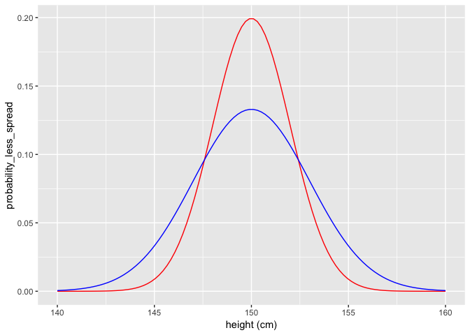

### The Probability Density Function

The probability density function visualizes the normal distribution's probability density function by mapping the values of x to its associated probability described by the distribution.

``` r
xValues <- seq(from = -5, to = 5, length = 100)
plotA <- dnorm(xValues, mean = 0, sd = 0.5)
plotB <-  dnorm(xValues, mean = 0, sd = 1)
plotC <-  dnorm(xValues, mean = 0, sd = 2)
plotD <-  dnorm(xValues, mean = -2, sd = 1)

normalDistributionsTibble <- tibble(x_value = xValues, 
                                    red_value = plotA,
                                    blue_value = plotB,
                                    green_value = plotC,
                                    purple_value = plotD)

p <- normalDistributionsTibble %>% ggplot()
p + 
  geom_line(aes(x = xValues, y = red_value), color = "red") +
  geom_line(aes(x = xValues, y = blue_value), color = "blue") +
  geom_line(aes(x = xValues, y = green_value), color = "green") +
  geom_line(aes(x = xValues, y = purple_value), color = "purple") +
  xlab("x") +
  ylab("f(x)")
```

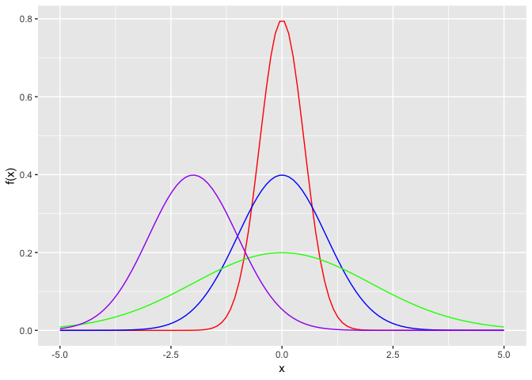

### The Cumulative Density Function (CDF)

The cumulative density funciton provides an alternative method for visualizing the distribution by showing the cumulative probabilities of all values smaller than x.

``` r
xValues <- seq(from = -5, to = 5, length = 100)
plotA <- pnorm(xValues, mean = 0, sd = 0.5)
plotB <-  pnorm(xValues, mean = 0, sd = 1)
plotC <-  pnorm(xValues, mean = 0, sd = 2)
plotD <-  pnorm(xValues, mean = -2, sd = 1)

normalDistributionsTibble <- tibble(x_value = xValues, 
                                    red_value = plotA,
                                    blue_value = plotB,
                                    green_value = plotC,
                                    purple_value = plotD)

p <- normalDistributionsTibble %>% ggplot()
p + 
  geom_line(aes(x = xValues, y = red_value), color = "red") +
  geom_line(aes(x = xValues, y = blue_value), color = "blue") +
  geom_line(aes(x = xValues, y = green_value), color = "green") +
  geom_line(aes(x = xValues, y = purple_value), color = "purple") +
  xlab("x") +
  ylab("f(x)")
```

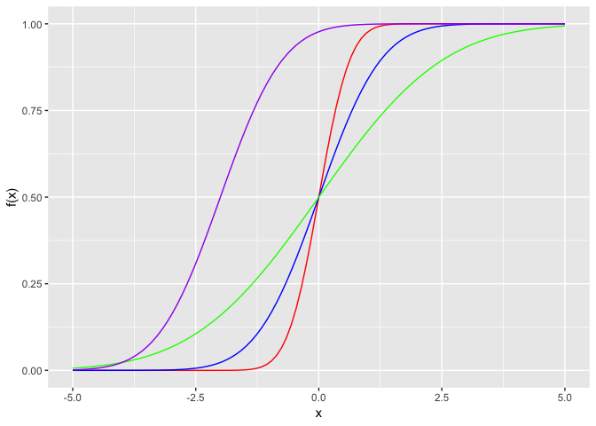

### Simulation Versus Perfect Distribution

Here, the R random number generator feature will be explored by overlapping a density plot with true variation.

``` r
meanValue <- 0
standardDeviation <- 1
numVals <- 100

xValues <- seq(from = -5, to = 5, length = numVals)
trueDistribution <- dnorm(xValues, mean = meanValue, sd = standardDeviation)

dataFrame <- tibble(x_value = xValues, true_value = trueDistribution)

set.seed(1)
randomVals <- rnorm(numVals, mean = meanValue, sd = standardDeviation)

dataFrame %>% ggplot() +
    geom_line(aes(x = x_value, y = true_value), color = "blue") +
    geom_line(aes(x = randomVals), color = "red", stat = "density") +
    geom_point(aes(x = randomVals, y = 0), color = "red", shape = 1, size = 3) +
    ylab("")
```

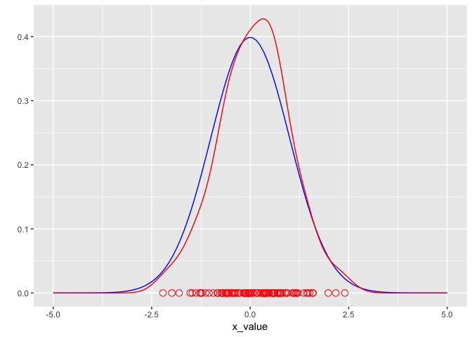

Part Two: The Central Limit Theorem
-----------------------------------

I will now demonstrate the central limit theorem by generating random samples from the chi-square distribution and showing that the sample means are normally distributed.

### The Chi-Square Distribution

The chi-square distribution will first be run in R:

``` r
degreeFreedom <- 1

xValues <- seq(from = 0, to = 20, length = 1000)
probabilityValues <- dchisq(xValues, df = degreeFreedom)

dataFrame <- tibble(x = xValues, 
                    probability = probabilityValues)

dataFrame %>% ggplot() +
  geom_line(aes(x = x, y = probability), color = "blue")
```


### Simulating Many Samples

Next, I will generate random values from this distribution using the rchisq() function.

Here, 1000 samples consisting of 100 random values will be generated:

``` r
set.seed(1)

sampleSize <- 100
numSamples <- 1000

degreeFreedom <- 1

randomChiSqValues <- rchisq(n = numSamples * sampleSize, df = degreeFreedom)
```

Here, I will visualize the distribution of these randomly generated values:

``` r
tibble(x = randomChiSqValues) %>% 
  ggplot() + 
  geom_density(aes(x = x), color = "blue")
```

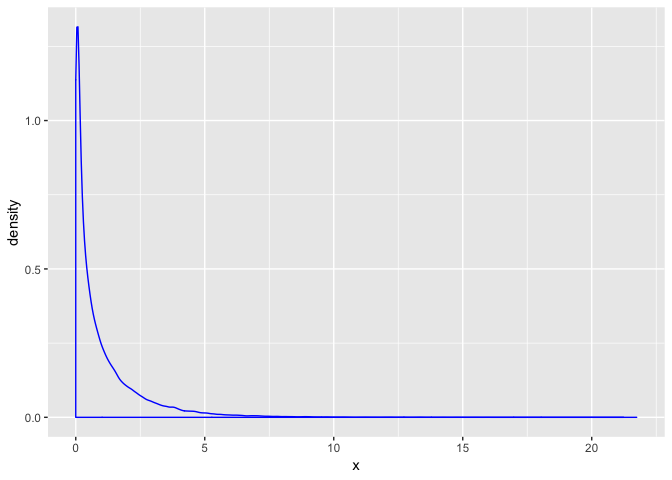

### Convergence to the Normal Distribution

Finally, I will separate the random values into 1000 samples, define the sample means, and observe the distribution of the sample mean:

``` r
samples <- matrix(randomChiSqValues, nrow = numSamples, ncol = sampleSize)
sampleMeans <- rowMeans(samples)

head(sampleMeans)
```

    ## [1] 1.0797031 1.1752284 0.9261440 0.9416424 0.9380011 1.1191603

``` r
tibble(x = sampleMeans) %>% 
  ggplot() + 
  geom_line(aes(x = x), stat = "density", color = "blue") +
  geom_point(aes(x = x, y = 0), color = "blue", shape = 1, size = 3)
```

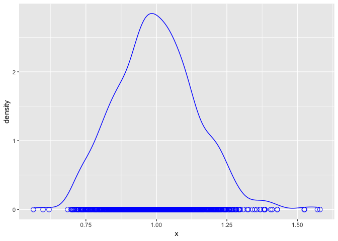

From this, I can see that the sample means converge to the normal distribution, demonstrating the CLT!

Part Three: Deliverables
------------------------

Here I will now complete the *seminar 2c deliverable* of testing how well the central limit theorem holds for smaller sample sizes. Specifically, for this deliverable the sample size of interest is n=5 with the number of samples maintained at 1000. However, to better highlight the purpose of sample size, I have additionally tested the central limit theorem for sample sizes of n=50 and n=10. The required sample size of n=5 is included at the bottom, in bold.

First, I will test a sample size of n=50.

``` r
set.seed(1)

sampleSize <- 50
numSamples <- 1000

degreeFreedom <- 1

randomChiSqValues <- rchisq(n = numSamples * sampleSize, df = degreeFreedom)
```

``` r
tibble(x = randomChiSqValues) %>% 
  ggplot() + 
  geom_density(aes(x = x), color = "blue")
```

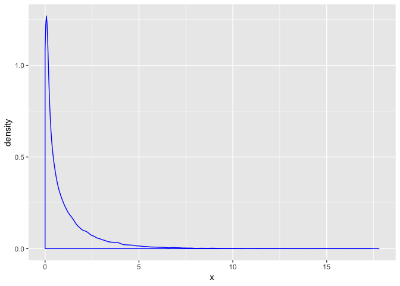

``` r
samples <- matrix(randomChiSqValues, nrow = numSamples, ncol = sampleSize)
sampleMeans <- rowMeans(samples)

head(sampleMeans)
```

    ## [1] 0.9491927 1.0962243 0.9249758 1.0276494 0.9655571 1.3762140

``` r
tibble(x = sampleMeans) %>% 
  ggplot() + 
  geom_line(aes(x = x), stat = "density", color = "blue") +
  geom_point(aes(x = x, y = 0), color = "blue", shape = 1, size = 3)
```

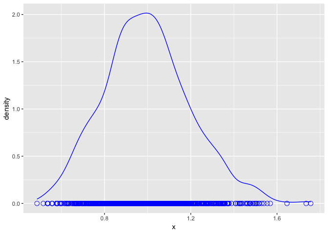

Now, I will test a sample size of n=10.

``` r
set.seed(1)

sampleSize <- 10
numSamples <- 1000

degreeFreedom <- 1

randomChiSqValues <- rchisq(n = numSamples * sampleSize, df = degreeFreedom)
```

``` r
tibble(x = randomChiSqValues) %>% 
  ggplot() + 
  geom_density(aes(x = x), color = "blue")
```

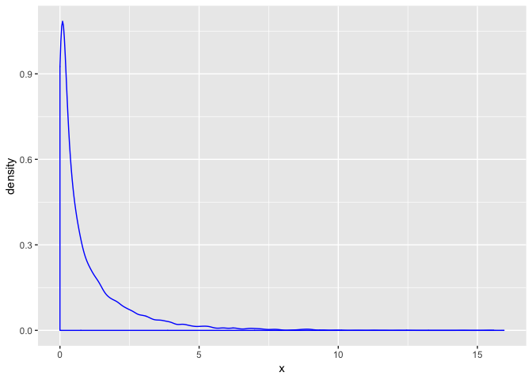

``` r
samples <- matrix(randomChiSqValues, nrow = numSamples, ncol = sampleSize)
sampleMeans <- rowMeans(samples)

head(sampleMeans)
```

    ## [1] 0.8696659 1.0221144 0.4972374 0.9012717 1.5829080 0.4035182

``` r
tibble(x = sampleMeans) %>% 
  ggplot() + 
  geom_line(aes(x = x), stat = "density", color = "blue") +
  geom_point(aes(x = x, y = 0), color = "blue", shape = 1, size = 3)
```

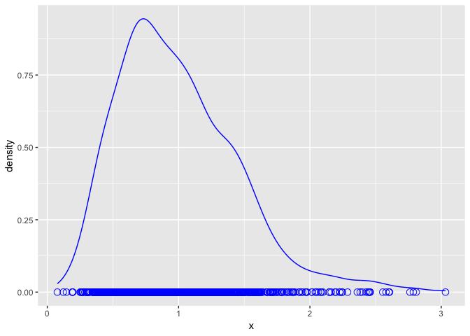

**Finally, I will test the sample size of n=5.**

``` r
set.seed(1)

sampleSize <- 5
numSamples <- 1000

degreeFreedom <- 1

randomChiSqValues <- rchisq(n = numSamples * sampleSize, df = degreeFreedom)
```

``` r
tibble(x = randomChiSqValues) %>% 
  ggplot() + 
  geom_density(aes(x = x), color = "blue")
```

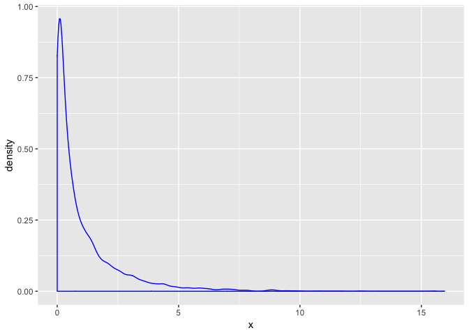

``` r
samples <- matrix(randomChiSqValues, nrow = numSamples, ncol = sampleSize)
sampleMeans <- rowMeans(samples)

head(sampleMeans)
```

    ## [1] 0.9271741 1.3116297 0.5027606 0.3370594 2.0871492 0.3149406

``` r
tibble(x = sampleMeans) %>% 
  ggplot() + 
  geom_line(aes(x = x), stat = "density", color = "blue") +
  geom_point(aes(x = x, y = 0), color = "blue", shape = 1, size = 3)
```

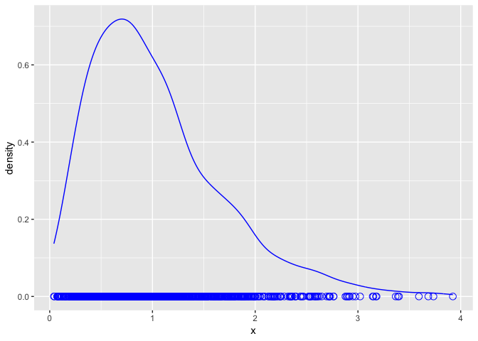

#### Conclusion:

Evidently, the central limit theorem (CLT) does not hold as well for smaller sample sizes. Using a sample size of 5 (compared to the previous sample size of 100), we can see that the distribution of the mean is right-skewed (poitively skewed). As the sample size was decreased from 100 to 50, from 50 to 10, and finally from 10 to 5, we can see that this increasing decrease results in higher deviance from the CLT. Ultimately, the observed distribution for n=5 is a result of this small sample size being \[1\] not large enoguh to accomplish the CLT, and \[2\] being a limited reflection of the variance that occurrs within the population. With larger sample sizes, as demonstrated through this exmaple, the distribution of the sample will appear more normally distributed and accurately demonstrate the CLT.
