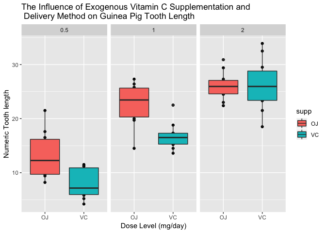

STAT 540 Practice Assignment
================
Matthew Shannon
2019-01-13

Part One
========

Introduction:
-------------

Hello, my name is **Matthew Shannon** and I am a first year direct-entry PhD student in the *Reproductive and Developmental Sciences* program here at The University of British Columbia.

My research is conducted within a Reproductive Immunology lab located at the BC Children's Hospital Research Institute. Specifically, my research project involves definining the interplay between infection, immune cell function, and fetal sex in pregnancy.

For more information about myself, I can also be found on [LinkedIn](https://www.linkedin.com/in/matthew-shannon-77146a106/).

Course Aspirations:
-------------------

Upon completion of STAT 540, it is my goal to \[1\] have a clearer understanding for the process of analyzing high dimensional biology data and \[2\] develop a strong familiarity with R statistical computing methods. A large portion of my research involves the use of RNA-seq methodology and analysis in R. As these methods are new to me, it is my hope that this course will help develop my understanding, streamline my data analysis, and contribute greater efficiency while completing my thesis. Finally, it is my hope that this course further enhances my professional development as an aspiring biomedical researcher as well as enhance my analytic skills. This will allow me to publish quality work in an efficient manner.

Repository Purpose:
-------------------

The purpose of this repository is to store all of my work completed for the STAT 540 class. This repository will serve as a critical aspect to my successful completion of this course and will provide a unified hub within which my homework assignments and seminar work can be stored and viewed on both GitHub and within R.

As well, this repository will serve as an initial introduction to 'R Markdown' and the benefits included in the use of this data storage format. Hopefully this repository will provide me with a working understanding for the functionalities of R and GitHub that can be applied to my own research moving beyond this course.

Additional Information:
-----------------------

Finally, in addition to the academic tangeables presented in this course, I am hoping to extend my social network through participation in the seminars and throguh lecture attendance. As a new individual in Vancouver and as a member of a small program (there are only 5 students in my cohort) I am excited to meet new individuals from diverse academic backgrounds.

Part Two
========

Data Inspection
---------------

Now I will begin to practice data inspection in R by exploring the Titanic dataset.

To do this, I will first open the data frame in R using the following line of code:

``` r
Titanic
```

Next, I will convert the array into a data frame, using the following function:

``` r
data.frame(Titanic)
```

### 2.1 Passenger Breakdown

##### How many children and adults were on the Titanic?

To determine the quantity of children and adults on board the Titanic, the following function was used to specifically show the survival rates of children and adults:

``` r
apply(Titanic, c(3,4), sum)
```

    ##        Survived
    ## Age       No Yes
    ##   Child   52  57
    ##   Adult 1438 654

From this, the total number of children and adults on the Titanic is shown, separated by those who survived and those who did not. In order to calculate the total number of children, the number of children who survived must be added to the number of children who did not survive:

``` r
x <- 52
y <- 57
z <- x + y
z
```

    ## [1] 109

From this analysis, we can see that z = 109. *Therefore, there were a total of **109 children** on board the Titanic*.

To find the total number of adults, the same methods will be applied:

``` r
x <- 1438
y <- 654
z <- x + y
z
```

    ## [1] 2092

z = 2092. *Therefore, there were **2092 adults** on board the Titanic*.

##### Were there more female adult or male adult passengers?

To determine if there were more female adult or male adult passengers on the Titanic the following line of code was run:

``` r
apply(Titanic, c(2,3), sum)
```

    ##         Age
    ## Sex      Child Adult
    ##   Male      64  1667
    ##   Female    45   425

From this, we can see the total number of male children, male adults, female children, and female adults. Here we are focused on the adult populations. Looking at the adult column, we can see that there are a total of **1667** adult male passengers and a total of **425** adult female passengers.

*Therefore, there were more male adult passengers than female adult passengers*.

### 2.2 Survival

##### Did the children have a better survival rate than the adults?

To determine if the children had a better survival rate than the adults the following line of code was again run to compare survival rates in children versus adults:

``` r
apply(Titanic, c(3, 4), sum)
```

    ##        Survived
    ## Age       No Yes
    ##   Child   52  57
    ##   Adult 1438 654

From this output, we now need to calculate the survival rate for children (the number of children that survived divided by the total number of children) and the survival rate for adults (the number of adults that survived divided by the total number of adults). This was done as follows:

Survival Rate of Children:

``` r
x <- 57
y <- 52 + 57
z <- x / y
z
```

    ## [1] 0.5229358

Survival Rate of Adults:

``` r
x <- 654
y <- 1438 + 654
z <- x / y
z
```

    ## [1] 0.3126195

From this we can see that the survival rate of children was **52.3%** and the survival rate of adults was **31.3%**. *Therefore, the children had a better survival rate than the adults*.

##### Which class of passengers have a better survival rate?

To determine which class of passengers have a better survival rate, the following line of code was used to compare passenger class to survival rate:

``` r
apply(Titanic, c(1, 4), sum)
```

    ##       Survived
    ## Class   No Yes
    ##   1st  122 203
    ##   2nd  167 118
    ##   3rd  528 178
    ##   Crew 673 212

From this output the survival rates for each passenger class can be easily calculated:

First Class Survival Rate:

``` r
x <- 203
y <- 122 + 203
z <- x / y
z
```

    ## [1] 0.6246154

Second Class Survival Rate:

``` r
x <- 118
y <- 167 + 118
z <- x / y
z
```

    ## [1] 0.4140351

Third Class Survival Rate:

``` r
x <- 178
y <- 528 + 178
z <- x / y
z
```

    ## [1] 0.2521246

Crew Survival Rate:

``` r
x <- 212
y <- 673 + 212
z <- x / y
z
```

    ## [1] 0.239548

From this we can see that the first class survival rate is **62.5%**, the second class survival rate is **41.4%**, the third class survival rate is **25.2%**, and the crew survival rate is **24.0%**.

*Therefore, the first class passengers have a better survival rate compared to all other economic statuses (classes) on the Titanic*.

Part Three
==========

Now, I will practice reading data from a text file and will practice graphing on R. To do this, I will use the 'guinea\_pigs\_tooth\_growth.txt' text file. This file is identical to the 'ToothGrowth' data file available in R.

To read this file into a data frame, the following line of code was run:

``` r
ToothGrowth <- read.table("guinea_pigs_tooth_growth.txt", header = TRUE)
```

As well, using the following function, the structure of the data set was displayed. This provided further information about the text file before graphing:

``` r
str(ToothGrowth)
```

    ## 'data.frame':    60 obs. of  3 variables:
    ##  $ len : num  4.2 11.5 7.3 5.8 6.4 10 11.2 11.2 5.2 7 ...
    ##  $ supp: Factor w/ 2 levels "OJ","VC": 2 2 2 2 2 2 2 2 2 2 ...
    ##  $ dose: num  0.5 0.5 0.5 0.5 0.5 0.5 0.5 0.5 0.5 0.5 ...

From this output, we can see that the 'guinea\_pigs\_tooth\_growth.txt' text file contains **60** observations of **3** variables.

Data Visualization
------------------

Next, I will create a figure of the ToothGrowth data frame. The ToothGrowth data frame shows how Guinea Pig tooth growth (odontoblast length) responds to one of three dose levels of vitamin C (0.5, 1, and 2 mg/day) delivered through either orange juice (OJ) or ascorbic acid (VC). The delivery method variable is named "supp" in this data frame.

To plot this data, I will use boxplots to compare the tooth length data for each delivery method, grouped by the vitamin C dose level.

The following code was run to generate this figure:

``` r
qplot(supp,len,data=ToothGrowth, facets=~dose, main="The Influence of Exogenous Vitamin C Supplementation and \n Delivery Method on Guinea Pig Tooth Length",xlab="Dose Level (mg/day)", ylab="Numeric Tooth length") + geom_boxplot(aes(fill = supp))
```



### How my Graph is Informative:

This graph is informative as it allows for better visualization of trends within the data frame. As a result, this graph is clearly able to demonstrate that the dose of vitamin C delivered is positively correlated with tooth length. As well, this graph is able to demonstrate that there is no observable difference between delivery method at the high dose of 2.0 mg/day while orange juice appears to confer a greater advantage on tooth growth at the lower doses of 0.5 and 1.0 mg/day. Statistical analysis is required to determine if these observations are significant, however.

### Why I Chose to Present the Data This Way:

Finally, I chose to represent the data frame this way as the graph provides a clear comparison of the effect of delivery method on tooth length at each dose level. Ultimately, this allows for comparison between the two methods for vitamin C delivery within each dose level, as well as comparison between the delivery methods across all dose levels. From this we can observe the dose response for each delivery method on tooth growth as well as compare the impact of OJ and VC delivery on tooth growth within each dose level. This allows for easier comprehension of the results of the experiment. Boxplots were chosen in this graph to visualize the spread of data in each condition. This allows for a more impactful and complete interpretation of the data. In contrast, a simple line graph would not have been able to show all of this information.
