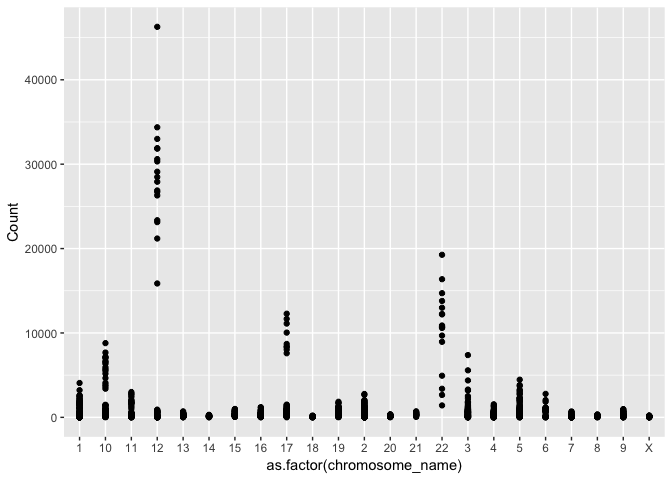
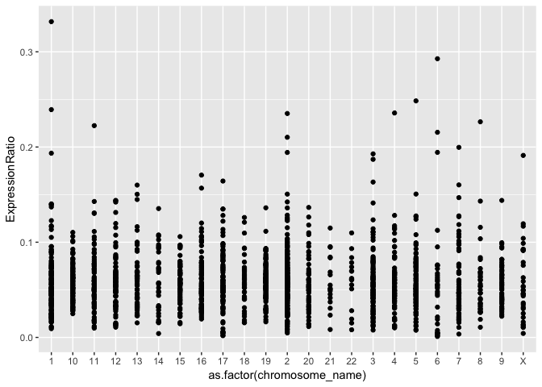
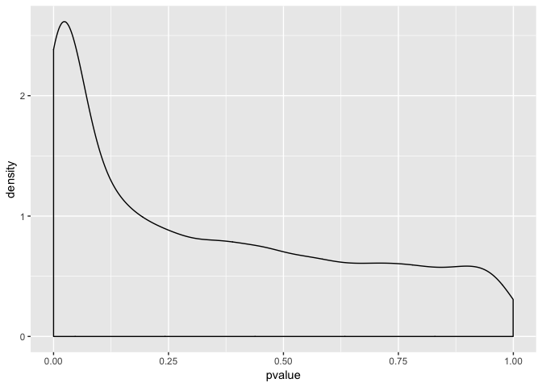

Seminar 3
================
Matthew Shannon
2019-01-29

The objective for this seminar is to understand how to use freely available genomic, transcriptomic, and proteomic data accessible from the Gene Expression Omnibus (GEO) server as well as to understand the use of the dplyr verb commands in R, to further practice ggplot2 graphical analysis in R, and finally, to practice statistical analysis in R.

### Loading Dependencies

Before beginning, the following packages must be installed:

``` r
#source("https://bioconductor.org/biocLite.R")
#biocLite("GEOquery")
#biocLite("biomaRt")
library(GEOquery)
```

    ## Loading required package: Biobase

    ## Loading required package: BiocGenerics

    ## Loading required package: parallel

    ## 
    ## Attaching package: 'BiocGenerics'

    ## The following objects are masked from 'package:parallel':
    ## 
    ##     clusterApply, clusterApplyLB, clusterCall, clusterEvalQ,
    ##     clusterExport, clusterMap, parApply, parCapply, parLapply,
    ##     parLapplyLB, parRapply, parSapply, parSapplyLB

    ## The following objects are masked from 'package:stats':
    ## 
    ##     IQR, mad, sd, var, xtabs

    ## The following objects are masked from 'package:base':
    ## 
    ##     anyDuplicated, append, as.data.frame, basename, cbind,
    ##     colMeans, colnames, colSums, dirname, do.call, duplicated,
    ##     eval, evalq, Filter, Find, get, grep, grepl, intersect,
    ##     is.unsorted, lapply, lengths, Map, mapply, match, mget, order,
    ##     paste, pmax, pmax.int, pmin, pmin.int, Position, rank, rbind,
    ##     Reduce, rowMeans, rownames, rowSums, sapply, setdiff, sort,
    ##     table, tapply, union, unique, unsplit, which, which.max,
    ##     which.min

    ## Welcome to Bioconductor
    ## 
    ##     Vignettes contain introductory material; view with
    ##     'browseVignettes()'. To cite Bioconductor, see
    ##     'citation("Biobase")', and for packages 'citation("pkgname")'.

    ## Setting options('download.file.method.GEOquery'='auto')

    ## Setting options('GEOquery.inmemory.gpl'=FALSE)

``` r
library(biomaRt)
#install.packages("tidyverse")
library(tidyverse)
```

    ## ── Attaching packages ─────────────────────────────────────────────────────────── tidyverse 1.2.1 ──

    ## ✔ ggplot2 3.1.0     ✔ purrr   0.3.0
    ## ✔ tibble  2.0.1     ✔ dplyr   0.7.8
    ## ✔ tidyr   0.8.2     ✔ stringr 1.3.1
    ## ✔ readr   1.3.1     ✔ forcats 0.3.0

    ## ── Conflicts ────────────────────────────────────────────────────────────── tidyverse_conflicts() ──
    ## ✖ dplyr::combine()    masks Biobase::combine(), BiocGenerics::combine()
    ## ✖ dplyr::filter()     masks stats::filter()
    ## ✖ dplyr::lag()        masks stats::lag()
    ## ✖ ggplot2::Position() masks BiocGenerics::Position(), base::Position()
    ## ✖ dplyr::select()     masks biomaRt::select()

``` r
#install.packages("data.table")
library(data.table)
```

    ## 
    ## Attaching package: 'data.table'

    ## The following objects are masked from 'package:dplyr':
    ## 
    ##     between, first, last

    ## The following object is masked from 'package:purrr':
    ## 
    ##     transpose

``` r
#install.packages("reshape2")
library(reshape2)
```

    ## 
    ## Attaching package: 'reshape2'

    ## The following objects are masked from 'package:data.table':
    ## 
    ##     dcast, melt

    ## The following object is masked from 'package:tidyr':
    ## 
    ##     smiths

Part 1: Accessing Data Using GEOquery
-------------------------------------

First, I will download a dataset from the GEO repository using the GEOquery package. As summarized in the seminar guidelines, this experiment explores gene expression differences between renal cell carcinoma cells (RCC) and adjacent normal cells using an Affymetric array.

``` r
gds <- getGEO("GDS507")
```

    ## File stored at:

    ## /var/folders/ts/fks0_ds12cd4hw1kbb25wb940000gn/T//Rtmp2FXsQo/GDS507.soft.gz

    ## Parsed with column specification:
    ## cols(
    ##   ID_REF = col_character(),
    ##   IDENTIFIER = col_character(),
    ##   GSM11815 = col_double(),
    ##   GSM11832 = col_double(),
    ##   GSM12069 = col_double(),
    ##   GSM12083 = col_double(),
    ##   GSM12101 = col_double(),
    ##   GSM12106 = col_double(),
    ##   GSM12274 = col_double(),
    ##   GSM12299 = col_double(),
    ##   GSM12412 = col_double(),
    ##   GSM11810 = col_double(),
    ##   GSM11827 = col_double(),
    ##   GSM12078 = col_double(),
    ##   GSM12099 = col_double(),
    ##   GSM12269 = col_double(),
    ##   GSM12287 = col_double(),
    ##   GSM12301 = col_double(),
    ##   GSM12448 = col_double()
    ## )

The following function was run to pbserve the structure of the dataset:

``` r
str(gds)
```

    ## Formal class 'GDS' [package "GEOquery"] with 3 slots
    ##   ..@ gpl      :Formal class 'GPL' [package "GEOquery"] with 2 slots
    ##   .. .. ..@ dataTable:Formal class 'GEODataTable' [package "GEOquery"] with 2 slots
    ##   .. .. .. .. ..@ columns:'data.frame':  0 obs. of  0 variables
    ##   .. .. .. .. ..@ table  :'data.frame':  0 obs. of  0 variables
    ##   .. .. ..@ header   : list()
    ##   ..@ dataTable:Formal class 'GEODataTable' [package "GEOquery"] with 2 slots
    ##   .. .. ..@ columns:'data.frame':    17 obs. of  4 variables:
    ##   .. .. .. ..$ sample       : Factor w/ 17 levels "GSM11810","GSM11815",..: 2 4 5 7 9 10 12 14 16 1 ...
    ##   .. .. .. ..$ disease.state: Factor w/ 2 levels "normal","RCC": 2 2 2 2 2 2 2 2 2 1 ...
    ##   .. .. .. ..$ individual   : Factor w/ 10 levels "001","005","011",..: 6 4 1 2 3 5 8 9 10 6 ...
    ##   .. .. .. ..$ description  : chr [1:17] "Value for GSM11815: C035 Renal Clear Cell Carcinoma U133B; src: Trizol isolation of total RNA from Renal Clear "| __truncated__ "Value for GSM11832: C023 Renal Clear Cell Carcinoma U133B; src: Trizol isolation of total RNA from Renal Clear "| __truncated__ "Value for GSM12069: C001 Renal Clear Cell Carcinoma U133B; src: Trizol isolation of total RNA from Renal Clear "| __truncated__ "Value for GSM12083: C005 Renal Clear Cell Carcinoma U133B; src: Trizol isolation of total RNA from Renal Clear "| __truncated__ ...
    ##   .. .. ..@ table  :'data.frame':    22645 obs. of  19 variables:
    ##   .. .. .. ..$ ID_REF    : chr [1:22645] "200000_s_at" "200001_at" "200002_at" "200003_s_at" ...
    ##   .. .. .. ..$ IDENTIFIER: chr [1:22645] "PRPF8" "CAPNS1" "RPL35" "MIR6805" ...
    ##   .. .. .. ..$ GSM11815  : num [1:22645] 4254 17996 41679 65391 19030 ...
    ##   .. .. .. ..$ GSM11832  : num [1:22645] 5298 12011 39117 34806 15814 ...
    ##   .. .. .. ..$ GSM12069  : num [1:22645] 4026 10284 38759 31257 16356 ...
    ##   .. .. .. ..$ GSM12083  : num [1:22645] 3498 2535 32848 28308 9580 ...
    ##   .. .. .. ..$ GSM12101  : num [1:22645] 3566 11048 39634 67448 14274 ...
    ##   .. .. .. ..$ GSM12106  : num [1:22645] 4903 13354 43511 56990 17217 ...
    ##   .. .. .. ..$ GSM12274  : num [1:22645] 6373 8564 46857 57972 19117 ...
    ##   .. .. .. ..$ GSM12299  : num [1:22645] 4829 17248 47032 57570 17488 ...
    ##   .. .. .. ..$ GSM12412  : num [1:22645] 5206 16018 22152 29062 14672 ...
    ##   .. .. .. ..$ GSM11810  : num [1:22645] 2757 6077 26661 35141 17733 ...
    ##   .. .. .. ..$ GSM11827  : num [1:22645] 3932 15704 26374 23629 18022 ...
    ##   .. .. .. ..$ GSM12078  : num [1:22645] 3730 10138 23810 22100 17957 ...
    ##   .. .. .. ..$ GSM12099  : num [1:22645] 3223 11614 24749 21651 15958 ...
    ##   .. .. .. ..$ GSM12269  : num [1:22645] 3640 8460 21937 18551 15800 ...
    ##   .. .. .. ..$ GSM12287  : num [1:22645] 4886 10283 31463 23496 16686 ...
    ##   .. .. .. ..$ GSM12301  : num [1:22645] 4070 11844 22734 21315 18817 ...
    ##   .. .. .. ..$ GSM12448  : num [1:22645] 3482 9742 25396 28631 17421 ...
    ##   .. .. .. ..- attr(*, "spec")=
    ##   .. .. .. .. .. cols(
    ##   .. .. .. .. ..   ID_REF = col_character(),
    ##   .. .. .. .. ..   IDENTIFIER = col_character(),
    ##   .. .. .. .. ..   GSM11815 = col_double(),
    ##   .. .. .. .. ..   GSM11832 = col_double(),
    ##   .. .. .. .. ..   GSM12069 = col_double(),
    ##   .. .. .. .. ..   GSM12083 = col_double(),
    ##   .. .. .. .. ..   GSM12101 = col_double(),
    ##   .. .. .. .. ..   GSM12106 = col_double(),
    ##   .. .. .. .. ..   GSM12274 = col_double(),
    ##   .. .. .. .. ..   GSM12299 = col_double(),
    ##   .. .. .. .. ..   GSM12412 = col_double(),
    ##   .. .. .. .. ..   GSM11810 = col_double(),
    ##   .. .. .. .. ..   GSM11827 = col_double(),
    ##   .. .. .. .. ..   GSM12078 = col_double(),
    ##   .. .. .. .. ..   GSM12099 = col_double(),
    ##   .. .. .. .. ..   GSM12269 = col_double(),
    ##   .. .. .. .. ..   GSM12287 = col_double(),
    ##   .. .. .. .. ..   GSM12301 = col_double(),
    ##   .. .. .. .. ..   GSM12448 = col_double()
    ##   .. .. .. .. .. )
    ##   ..@ header   :List of 23
    ##   .. ..$ channel_count           : chr "1"
    ##   .. ..$ dataset_id              : chr [1:12] "GDS507" "GDS507" "GDS507" "GDS507" ...
    ##   .. ..$ description             : chr [1:13] "Investigation into mechanisms of renal clear cell carcinogenesis (RCC). Comparison of renal clear cell tumor ti"| __truncated__ "RCC" "normal" "035" ...
    ##   .. ..$ email                   : chr "geo@ncbi.nlm.nih.gov"
    ##   .. ..$ feature_count           : chr "22645"
    ##   .. ..$ institute               : chr "NCBI NLM NIH"
    ##   .. ..$ name                    : chr "Gene Expression Omnibus (GEO)"
    ##   .. ..$ order                   : chr "none"
    ##   .. ..$ platform                : chr "GPL97"
    ##   .. ..$ platform_organism       : chr "Homo sapiens"
    ##   .. ..$ platform_technology_type: chr "in situ oligonucleotide"
    ##   .. ..$ pubmed_id               : chr "14641932"
    ##   .. ..$ ref                     : chr "Nucleic Acids Res. 2005 Jan 1;33 Database Issue:D562-6"
    ##   .. ..$ reference_series        : chr "GSE781"
    ##   .. ..$ sample_count            : chr "17"
    ##   .. ..$ sample_id               : chr [1:12] "GSM11815,GSM11832,GSM12069,GSM12083,GSM12101,GSM12106,GSM12274,GSM12299,GSM12412" "GSM11810,GSM11827,GSM12078,GSM12099,GSM12269,GSM12287,GSM12301,GSM12448" "GSM11810,GSM11815" "GSM11827,GSM11832" ...
    ##   .. ..$ sample_organism         : chr "Homo sapiens"
    ##   .. ..$ sample_type             : chr "RNA"
    ##   .. ..$ title                   : chr "Renal clear cell carcinoma (HG-U133B)"
    ##   .. ..$ type                    : chr [1:13] "Expression profiling by array" "disease state" "disease state" "individual" ...
    ##   .. ..$ update_date             : chr "Mar 04 2004"
    ##   .. ..$ value_type              : chr "count"
    ##   .. ..$ web_link                : chr "http://www.ncbi.nlm.nih.gov/geo"

Next, I will extract a meta data table and a gene expression table:

``` r
meta_data <- data.frame(Sample = gds@dataTable@columns$sample, disease = gds@dataTable@columns$disease.state)
gds_data <- gds@dataTable@table
```

Part Two: Exploring a Gene Expression Dataset
---------------------------------------------

To see the structure of the data, the following function was run to see the first few rows of the dataset:

``` r
head(gds_data)
```

    ##        ID_REF IDENTIFIER GSM11815 GSM11832 GSM12069 GSM12083 GSM12101
    ## 1 200000_s_at      PRPF8   4254.0   5298.2   4026.5   3498.4   3566.4
    ## 2   200001_at     CAPNS1  17996.2  12010.7  10283.5   2534.7  11048.4
    ## 3   200002_at      RPL35  41678.8  39116.9  38758.9  32847.7  39633.9
    ## 4 200003_s_at    MIR6805  65390.9  34806.2  31257.2  28308.5  67447.5
    ## 5   200004_at     EIF4G2  19030.1  15813.6  16355.7   9579.7  14273.5
    ## 6   200005_at      EIF3D   8824.5   9706.2  10590.0   6986.7   9400.4
    ##   GSM12106 GSM12274 GSM12299 GSM12412 GSM11810 GSM11827 GSM12078 GSM12099
    ## 1   4903.1   6372.6   4829.1   5205.8   2756.8   3932.0   3729.9   3223.4
    ## 2  13354.0   8563.8  17247.6  16018.5   6077.0  15703.8  10138.5  11614.4
    ## 3  43511.2  46856.7  47032.4  22152.2  26660.7  26373.6  23809.6  24749.3
    ## 4  56989.9  57972.5  57570.5  29062.2  35140.9  23629.3  22100.5  21651.0
    ## 5  17217.0  19116.9  17487.6  14671.6  17733.1  18022.4  17957.4  15958.0
    ## 6  12835.2  10299.0  12375.2   7645.4   8661.5   7355.7   6973.4   6855.9
    ##   GSM12269 GSM12287 GSM12301 GSM12448
    ## 1   3640.5   4886.3   4070.2   3482.1
    ## 2   8460.5  10282.6  11844.3   9741.6
    ## 3  21936.8  31462.8  22733.7  25395.5
    ## 4  18550.7  23496.5  21315.4  28631.4
    ## 5  15799.8  16685.8  18817.3  17421.1
    ## 6   7949.2   9486.5   7494.5   7252.1

Here I will identify the total number of rows in the dataset:

``` r
nrow(gds_data)
```

    ## [1] 22645

Here I will identify the total number of columns in the dataset:

``` r
ncol(gds_data)
```

    ## [1] 19

Next, I will use the apply() function to compute the average count in each sample:

``` r
apply(gds_data[,-c(1, 2)], 2, median)
```

    ## GSM11815 GSM11832 GSM12069 GSM12083 GSM12101 GSM12106 GSM12274 GSM12299 
    ##    265.6    250.3    218.5    309.7    281.9    240.1    280.2    217.0 
    ## GSM12412 GSM11810 GSM11827 GSM12078 GSM12099 GSM12269 GSM12287 GSM12301 
    ##    264.4    273.8    264.6    266.5    269.3    288.6    238.7    244.5 
    ## GSM12448 
    ##    264.3

#### Practice with Tidy Datasets:

The iris dataset is a freely available, tidy dataset accessible in R. This dataset describes the flower parts for many species.

``` r
head(iris)
```

    ##   Sepal.Length Sepal.Width Petal.Length Petal.Width Species
    ## 1          5.1         3.5          1.4         0.2  setosa
    ## 2          4.9         3.0          1.4         0.2  setosa
    ## 3          4.7         3.2          1.3         0.2  setosa
    ## 4          4.6         3.1          1.5         0.2  setosa
    ## 5          5.0         3.6          1.4         0.2  setosa
    ## 6          5.4         3.9          1.7         0.4  setosa

The following lines of code were run to practice data manipulation using the dplyr verbs:

Practice using the filter() function:

``` r
iris %>% 
    filter(Sepal.Length > 5) %>% 
    head()
```

    ##   Sepal.Length Sepal.Width Petal.Length Petal.Width Species
    ## 1          5.1         3.5          1.4         0.2  setosa
    ## 2          5.4         3.9          1.7         0.4  setosa
    ## 3          5.4         3.7          1.5         0.2  setosa
    ## 4          5.8         4.0          1.2         0.2  setosa
    ## 5          5.7         4.4          1.5         0.4  setosa
    ## 6          5.4         3.9          1.3         0.4  setosa

Practice using the group\_by() function:

``` r
iris %>% 
    group_by(Species) %>% 
    head()
```

    ## # A tibble: 6 x 5
    ## # Groups:   Species [1]
    ##   Sepal.Length Sepal.Width Petal.Length Petal.Width Species
    ##          <dbl>       <dbl>        <dbl>       <dbl> <fct>  
    ## 1          5.1         3.5          1.4         0.2 setosa 
    ## 2          4.9         3            1.4         0.2 setosa 
    ## 3          4.7         3.2          1.3         0.2 setosa 
    ## 4          4.6         3.1          1.5         0.2 setosa 
    ## 5          5           3.6          1.4         0.2 setosa 
    ## 6          5.4         3.9          1.7         0.4 setosa

Practice using the select() function:

(Practice 1/4)

``` r
iris %>% 
    dplyr::select(Sepal.Width) %>% 
    head()
```

    ##   Sepal.Width
    ## 1         3.5
    ## 2         3.0
    ## 3         3.2
    ## 4         3.1
    ## 5         3.6
    ## 6         3.9

(Practice 2/4)

``` r
iris %>% 
    dplyr::select(Sepal.Length) %>% 
    head()
```

    ##   Sepal.Length
    ## 1          5.1
    ## 2          4.9
    ## 3          4.7
    ## 4          4.6
    ## 5          5.0
    ## 6          5.4

(Practice 3/4)

``` r
iris %>% 
    dplyr::select(Petal.Length) %>% 
    head()
```

    ##   Petal.Length
    ## 1          1.4
    ## 2          1.4
    ## 3          1.3
    ## 4          1.5
    ## 5          1.4
    ## 6          1.7

(Practice 4/4)

``` r
iris %>% 
    dplyr::select(Petal.Width) %>% 
    head()
```

    ##   Petal.Width
    ## 1         0.2
    ## 2         0.2
    ## 3         0.2
    ## 4         0.2
    ## 5         0.2
    ## 6         0.4

Practice using the mutate() function:

``` r
iris %>%
    group_by(Species) %>% 
    mutate(Capitalized_names = toupper(Species)) %>% 
    head()
```

    ## # A tibble: 6 x 6
    ## # Groups:   Species [1]
    ##   Sepal.Length Sepal.Width Petal.Length Petal.Width Species
    ##          <dbl>       <dbl>        <dbl>       <dbl> <fct>  
    ## 1          5.1         3.5          1.4         0.2 setosa 
    ## 2          4.9         3            1.4         0.2 setosa 
    ## 3          4.7         3.2          1.3         0.2 setosa 
    ## 4          4.6         3.1          1.5         0.2 setosa 
    ## 5          5           3.6          1.4         0.2 setosa 
    ## 6          5.4         3.9          1.7         0.4 setosa 
    ## # … with 1 more variable: Capitalized_names <chr>

Practice using the summarize() function:

``` r
iris %>% 
    group_by(Species) %>% 
    summarize(average_sepal_length = mean(Sepal.Length), n = n()) %>% 
    head()
```

    ## # A tibble: 3 x 3
    ##   Species    average_sepal_length     n
    ##   <fct>                     <dbl> <int>
    ## 1 setosa                     5.01    50
    ## 2 versicolor                 5.94    50
    ## 3 virginica                  6.59    50

Practice using the arrange() function:

``` r
iris %>% 
    arrange(desc(Species)) %>% 
    head()
```

    ##   Sepal.Length Sepal.Width Petal.Length Petal.Width   Species
    ## 1          6.3         3.3          6.0         2.5 virginica
    ## 2          5.8         2.7          5.1         1.9 virginica
    ## 3          7.1         3.0          5.9         2.1 virginica
    ## 4          6.3         2.9          5.6         1.8 virginica
    ## 5          6.5         3.0          5.8         2.2 virginica
    ## 6          7.6         3.0          6.6         2.1 virginica

To further practice the dplyr verbs, the freely available band\_members dataset and the band\_instruments dataset accesible in R were additionally used. The band\_members dataset describes the members of the Beatles and Rolling Stones while the band\_instruments dataset describes the instruments used by the previously mentioned bands.

``` r
head(band_members)
```

    ## # A tibble: 3 x 2
    ##   name  band   
    ##   <chr> <chr>  
    ## 1 Mick  Stones 
    ## 2 John  Beatles
    ## 3 Paul  Beatles

``` r
head(band_instruments)
```

    ## # A tibble: 3 x 2
    ##   name  plays 
    ##   <chr> <chr> 
    ## 1 John  guitar
    ## 2 Paul  bass  
    ## 3 Keith guitar

Practice using the join() function:

(Practice 1/3)

``` r
band_members %>% left_join(band_instruments) 
```

    ## Joining, by = "name"

    ## # A tibble: 3 x 3
    ##   name  band    plays 
    ##   <chr> <chr>   <chr> 
    ## 1 Mick  Stones  <NA>  
    ## 2 John  Beatles guitar
    ## 3 Paul  Beatles bass

(Practice 2/3)

``` r
band_members %>% right_join(band_instruments)
```

    ## Joining, by = "name"

    ## # A tibble: 3 x 3
    ##   name  band    plays 
    ##   <chr> <chr>   <chr> 
    ## 1 John  Beatles guitar
    ## 2 Paul  Beatles bass  
    ## 3 Keith <NA>    guitar

(Practice 3/3)

``` r
band_members %>% full_join(band_instruments)
```

    ## Joining, by = "name"

    ## # A tibble: 4 x 3
    ##   name  band    plays 
    ##   <chr> <chr>   <chr> 
    ## 1 Mick  Stones  <NA>  
    ## 2 John  Beatles guitar
    ## 3 Paul  Beatles bass  
    ## 4 Keith <NA>    guitar

Finally, I will apply the above functions to the gene expression dataset.

Before doing this, I must take the un-tidy gene expression dataset and rearrange it into a manner that is readable by R. This will be done using the melt() function from the reshape2 package:

``` r
melted_data <- melt(gds_data, id.vars = c("ID_REF", "IDENTIFIER"), var = "Sample")
head(melted_data)
```

    ##        ID_REF IDENTIFIER   Sample   value
    ## 1 200000_s_at      PRPF8 GSM11815  4254.0
    ## 2   200001_at     CAPNS1 GSM11815 17996.2
    ## 3   200002_at      RPL35 GSM11815 41678.8
    ## 4 200003_s_at    MIR6805 GSM11815 65390.9
    ## 5   200004_at     EIF4G2 GSM11815 19030.1
    ## 6   200005_at      EIF3D GSM11815  8824.5

Now there are four columns in the dataset, each one corresponding to a variable: the probe name, the gene name, the sample name and the count.

First, I will calculate the mean gene expression level for each sample:

``` r
melted_data %>% 
    group_by(Sample) %>% 
    summarize(mean = mean(value))
```

    ## # A tibble: 17 x 2
    ##    Sample    mean
    ##    <fct>    <dbl>
    ##  1 GSM11815  751.
    ##  2 GSM11832  742.
    ##  3 GSM12069  748.
    ##  4 GSM12083  735.
    ##  5 GSM12101  803.
    ##  6 GSM12106  744.
    ##  7 GSM12274  761.
    ##  8 GSM12299  802.
    ##  9 GSM12412  685.
    ## 10 GSM11810  765.
    ## 11 GSM11827  780.
    ## 12 GSM12078  774.
    ## 13 GSM12099  766.
    ## 14 GSM12269  710.
    ## 15 GSM12287  791.
    ## 16 GSM12301  770.
    ## 17 GSM12448  757.

Next, because there are multiple probes mapping to a specific gene, I will use the summarize() function to take the mean of each probe's expression:

``` r
(new_melted_data <- melted_data %>% 
    group_by(Sample, IDENTIFIER) %>% 
    summarize(Count = mean(value)))
```

    ## # A tibble: 279,905 x 3
    ## # Groups:   Sample [?]
    ##    Sample   IDENTIFIER   Count
    ##    <fct>    <chr>        <dbl>
    ##  1 GSM11815 --Control   8139. 
    ##  2 GSM11815 222968_at    102. 
    ##  3 GSM11815 223641_at    200. 
    ##  4 GSM11815 224429_x_at 2385. 
    ##  5 GSM11815 224438_at     32.1
    ##  6 GSM11815 225714_s_at  291. 
    ##  7 GSM11815 225934_at    284. 
    ##  8 GSM11815 226014_at     66.3
    ##  9 GSM11815 226061_s_at   45.1
    ## 10 GSM11815 226138_s_at   23.3
    ## # … with 279,895 more rows

Next, the biomaRt package will be used to explore information about specific genes of interest. For example, to understand the gene expression on a particular chromosome across all samples, biomaRt can look up the chromosomal location of each gene:

First, a connection will be opened between biomaRt and R:

``` r
human = useMart("ensembl", dataset = "hsapiens_gene_ensembl")
```

Next, I will take my dataframe and output it with associated chromosome annotations:

``` r
identify_gene_names <- function(df){
    names(df) <- c("Sample", "hgnc_symbol", "Count")
    names <- getBM( attributes=c("hgnc_symbol", "chromosome_name") , filters= "hgnc_symbol", values = unique(df$hgnc_symbol), mart = human)
    left_join(df, names, by = "hgnc_symbol")
}
```

Finally, I will filter out all genes with annotations that are not number numbers between 1 and 23, X, or Y:

``` r
data_with_chromosome <- identify_gene_names(new_melted_data) %>% 
    filter(chromosome_name %in% c(1:23, "X", "Y"))
```

``` r
head(data_with_chromosome)
```

    ## # A tibble: 6 x 4
    ## # Groups:   Sample [1]
    ##   Sample   hgnc_symbol Count chromosome_name
    ##   <fct>    <chr>       <dbl> <chr>          
    ## 1 GSM11815 A1BG        191.  19             
    ## 2 GSM11815 A1BG-AS1     53   19             
    ## 3 GSM11815 A1CF        188.  10             
    ## 4 GSM11815 A2MP1       442.  12             
    ## 5 GSM11815 AADACL2      14.9 3              
    ## 6 GSM11815 AADAT       448.  4

### Part Two: Exercise

To identify how the average expression of genes on the X chromosome changes between RCC and normal cells, the information from the meta data file (meta\_data) and the expression table (data\_with\_chromosome) must be combined.

``` r
full_data <- left_join(data_with_chromosome, meta_data, by = "Sample")
```

    ## Warning: Column `Sample` joining factors with different levels, coercing to
    ## character vector

Next, I will use the dplyr verbs to group all samples by disease status, filter out all non-X-chromosome genes, and then calcualte the mean using the summarize() function:

``` r
full_data %>% 
    group_by(disease) %>% 
    filter(chromosome_name == "X") %>% 
    summarize(mean = mean(Count))
```

    ## # A tibble: 2 x 2
    ##   disease  mean
    ##   <fct>   <dbl>
    ## 1 normal   684.
    ## 2 RCC      657.

Part Three: Graphing Expression Data
------------------------------------

In this section, I will practice graphing my count data using ggplot2.

However, all of the probes cannot be graphed and therefore I will choose a random sampling of 100:

``` r
set.seed(5747540)
```

``` r
sample_to_choose <- sample(1:length(unique(full_data$hgnc_symbol)), size = 100)
```

``` r
names_to_choose <- as.character(unique(full_data$hgnc_symbol)[sample_to_choose])
```

Graphical output of random sampling:

``` r
full_data %>% 
    filter(hgnc_symbol %in% names_to_choose) %>% 
    group_by(Sample) %>% 
    ggplot(aes(x = as.factor(chromosome_name), y = Count)) + geom_point()
```



### Part Three: Exercise

For this exercise, I will calculate the sum of all counts in each sample and divide each expression value by that sum:

``` r
full_data %>%
    filter(hgnc_symbol %in% names_to_choose) %>% 
    group_by(Sample) %>% 
    mutate(SumCount = sum(Count)) %>%
    mutate(ExpressionRatio = c(Count/sum(Count)))
```

    ## # A tibble: 1,700 x 7
    ## # Groups:   Sample [17]
    ##    Sample hgnc_symbol  Count chromosome_name disease SumCount
    ##    <chr>  <chr>        <dbl> <chr>           <fct>      <dbl>
    ##  1 GSM11… ADAMTS10     467.  19              RCC       90408.
    ##  2 GSM11… AGAP2         20   12              RCC       90408.
    ##  3 GSM11… AGR2          67.8 7               RCC       90408.
    ##  4 GSM11… ALKBH6      1702.  19              RCC       90408.
    ##  5 GSM11… BAD          101.  11              RCC       90408.
    ##  6 GSM11… BCDIN3D-AS1  238.  12              RCC       90408.
    ##  7 GSM11… BEND3       1138   6               RCC       90408.
    ##  8 GSM11… C15orf65     238.  15              RCC       90408.
    ##  9 GSM11… C1GALT1C1L   142.  2               RCC       90408.
    ## 10 GSM11… C4orf47      308.  4               RCC       90408.
    ## # … with 1,690 more rows, and 1 more variable: ExpressionRatio <dbl>

Finally, I will plot this new, transformed column:

``` r
full_data %>%
    filter(hgnc_symbol %in% names_to_choose) %>% 
    group_by(hgnc_symbol) %>% 
    mutate(CountSum = c(Count/sum(Count))) %>%
    mutate(ExpressionRatio = c(Count/sum(Count))) %>%
    ggplot(aes(x = as.factor(chromosome_name), y = ExpressionRatio)) + geom_point()
```



Part Four: Analyzing the Results of Statistical Tests
-----------------------------------------------------

In this section I will run statistical tests on the data. Here, I will identify the genes that are differentially expressed between the normal and RCC samples by means of running a t-test for each gene using the summarize( function:

``` r
full_data %>%
    group_by(hgnc_symbol) %>% 
    summarize( pvalue = t.test(Count ~ disease)$p.value)
```

    ## # A tibble: 9,359 x 2
    ##    hgnc_symbol pvalue
    ##    <chr>        <dbl>
    ##  1 A1BG        0.708 
    ##  2 A1BG-AS1    0.0366
    ##  3 A1CF        0.132 
    ##  4 A2MP1       0.0245
    ##  5 AADACL2     0.143 
    ##  6 AADAT       0.0304
    ##  7 AAGAB       0.469 
    ##  8 AAK1        0.0229
    ##  9 AARS2       0.0416
    ## 10 AASDH       0.0743
    ## # … with 9,349 more rows

### Part Four: Exercise

For this exercise, I will make a density plot using geom\_density() graph of the p-value distributions of the above t-test:

``` r
full_data %>%
    group_by (hgnc_symbol) %>% 
    summarize (pvalue = t.test(Count ~ disease)$p.value) %>%
    ggplot(aes(x = pvalue)) + geom_density()
```



As well, I will here extract a data frame of all genes with p-values lower than 0.05:

``` r
full_data %>%
    group_by (hgnc_symbol) %>% 
    summarize (pvalue = t.test(Count ~ disease)$p.value) %>%
    filter(pvalue < 0.05) %>%
    head()
```

    ## # A tibble: 6 x 2
    ##   hgnc_symbol  pvalue
    ##   <chr>         <dbl>
    ## 1 A1BG-AS1    0.0366 
    ## 2 A2MP1       0.0245 
    ## 3 AADAT       0.0304 
    ## 4 AAK1        0.0229 
    ## 5 AARS2       0.0416 
    ## 6 ABCB1       0.00351

Finally, I will extract the name of the gene with the lowest p-value:

``` r
(pvalue_less_0.5 <- full_data %>%
    group_by (hgnc_symbol) %>% 
    summarize (pvalue = t.test(Count ~ disease)$p.value) %>%
    arrange(pvalue) %>%
    head(1))
```

    ## # A tibble: 1 x 2
    ##   hgnc_symbol        pvalue
    ##   <chr>               <dbl>
    ## 1 CLDN2       0.00000000591

Therefore, the gene with the lowest p-value is CLDN2, or Claudin-2.

### Part Two Exercise: Modifying the Code to Include Transcript Length

For this exercise, I will modify an earlier code to also identify the length of each gene captured in the dataset:

``` r
human = useMart("ensembl", dataset = "hsapiens_gene_ensembl")
```

``` r
identify_gene_names <- function(df){
    names(df) <- c("Sample", "hgnc_symbol", "Count")
    names <- getBM( attributes=c("hgnc_symbol", "chromosome_name", "transcript_length") , filters= "hgnc_symbol", values = unique(df$hgnc_symbol), mart = human)
    left_join(df, names, by = "hgnc_symbol")
}
```

``` r
data_with_chromosome <- identify_gene_names(new_melted_data) %>% 
    filter(chromosome_name %in% c(1:23, "X", "Y"))
```

``` r
head(data_with_chromosome)
```

    ## # A tibble: 6 x 5
    ## # Groups:   Sample [1]
    ##   Sample   hgnc_symbol Count chromosome_name transcript_length
    ##   <fct>    <chr>       <dbl> <chr>                       <int>
    ## 1 GSM11815 A1BG         191. 19                           2134
    ## 2 GSM11815 A1BG         191. 19                           1722
    ## 3 GSM11815 A1BG         191. 19                           2301
    ## 4 GSM11815 A1BG         191. 19                            475
    ## 5 GSM11815 A1BG         191. 19                            917
    ## 6 GSM11815 A1BG-AS1      53  19                           1718

``` r
full_data <- left_join(data_with_chromosome, meta_data, by = "Sample")
```

    ## Warning: Column `Sample` joining factors with different levels, coercing to
    ## character vector

``` r
full_data %>% 
    group_by(disease) %>% 
    filter(chromosome_name == "X") %>% 
    summarize(mean = mean(Count))
```

    ## # A tibble: 2 x 2
    ##   disease  mean
    ##   <fct>   <dbl>
    ## 1 normal   736.
    ## 2 RCC      770.
