Seminar 4: Differential Expression Analysis
================
Matthew Shannon
2019-02-09

The objective for this seminar is to provide a clear understanding for differential expression testing, to provide practical experience browsing and manipulating real gene expression data, plotting expression changes as a trajectory with ggplot2, testing for differential expression in single genes via the lm() function, finding differential expressions in a large number of genes and across multiple covariates using the limma() function, and to perform genome wide differential expression analysis given expression data and covariates and interpret the resulting statistics.

Loading Dependencies
--------------------

Before beginning, the following packages must be installed:

``` r
#install.packages("tidyverse", dependencies = TRUE)
library(tidyverse)
```

    ## ── Attaching packages ──────────────────────────────────────────────────────────────────── tidyverse 1.2.1 ──

    ## ✔ ggplot2 3.1.0       ✔ purrr   0.3.0  
    ## ✔ tibble  2.0.1       ✔ dplyr   0.8.0.1
    ## ✔ tidyr   0.8.2       ✔ stringr 1.4.0  
    ## ✔ readr   1.3.1       ✔ forcats 0.3.0

    ## ── Conflicts ─────────────────────────────────────────────────────────────────────── tidyverse_conflicts() ──
    ## ✖ dplyr::filter() masks stats::filter()
    ## ✖ dplyr::lag()    masks stats::lag()

``` r
#install.packages("reshape2", dependencies = TRUE)
library(reshape2)
```

    ## 
    ## Attaching package: 'reshape2'

    ## The following object is masked from 'package:tidyr':
    ## 
    ##     smiths

``` r
source("https://bioconductor.org/biocLite.R")
```

    ## Bioconductor version 3.7 (BiocInstaller 1.30.0), ?biocLite for help

    ## A newer version of Bioconductor is available for this version of R,
    ##   ?BiocUpgrade for help

``` r
biocLite("limma")
```

    ## BioC_mirror: https://bioconductor.org

    ## Using Bioconductor 3.7 (BiocInstaller 1.30.0), R 3.5.2 (2018-12-20).

    ## Installing package(s) 'limma'

    ## 
    ## The downloaded binary packages are in
    ##  /var/folders/ts/fks0_ds12cd4hw1kbb25wb940000gn/T//RtmpjwFOFx/downloaded_packages

``` r
library(limma)
#install.packages("knitr", dependencies = TRUE)
library(knitr)
```

Part 1: Introduction
--------------------

An introduction for this seminar can be found [here](https://github.com/STAT540-UBC/STAT540-UBC.github.io/tree/master//seminars/seminars_winter_2019/seminar4/sm4_differential_expression_analysis.md).

Part 2: Gene Expression Data
----------------------------

### Importing the Data

For this seminar, the the GSE4051 dataset will be used. The file for the dataset is found [here](https://github.com/STAT540-UBC/STAT540-UBC.github.io/blob/master/seminars/seminars_winter_2019/seminar4/expression_data).

First, the expression matrix is loaded:

``` r
expressionMatrix <- read.table("GSE4051_data.tsv", stringsAsFactors = FALSE, sep = "\t", quote = "")
expressionMatrix <- expressionMatrix %>% rownames_to_column("gene")
expressionMatrix <- expressionMatrix %>% as_tibble()

expressionMatrix
```

    ## # A tibble: 29,949 x 40
    ##    gene  Sample_20 Sample_21 Sample_22 Sample_23 Sample_16 Sample_17
    ##    <chr>     <dbl>     <dbl>     <dbl>     <dbl>     <dbl>     <dbl>
    ##  1 1415…      7.24      7.41      7.17      7.07      7.38      7.34
    ##  2 1415…      9.48     10.0       9.85     10.1       7.64     10.0 
    ##  3 1415…     10.0      10.0       9.91      9.91      8.42     10.2 
    ##  4 1415…      8.36      8.37      8.40      8.49      8.36      8.37
    ##  5 1415…      8.59      8.62      8.52      8.64      8.51      8.89
    ##  6 1415…      9.59      9.72      9.71      9.7       9.66      9.61
    ##  7 1415…      9.68     10.4       9.87     10.2       8.04     10.0 
    ##  8 1415…      7.24      7.90      7.48      7.49      7.34      7.34
    ##  9 1415…     11.7      11.5      11.5      11.6      10.5      11.8 
    ## 10 1415…      9.21     10.1       9.82      9.92      8.22      9.60
    ## # … with 29,939 more rows, and 33 more variables: Sample_6 <dbl>,
    ## #   Sample_24 <dbl>, Sample_25 <dbl>, Sample_26 <dbl>, Sample_27 <dbl>,
    ## #   Sample_14 <dbl>, Sample_3 <dbl>, Sample_5 <dbl>, Sample_8 <dbl>,
    ## #   Sample_28 <dbl>, Sample_29 <dbl>, Sample_30 <dbl>, Sample_31 <dbl>,
    ## #   Sample_1 <dbl>, Sample_10 <dbl>, Sample_4 <dbl>, Sample_7 <dbl>,
    ## #   Sample_32 <dbl>, Sample_33 <dbl>, Sample_34 <dbl>, Sample_35 <dbl>,
    ## #   Sample_13 <dbl>, Sample_15 <dbl>, Sample_18 <dbl>, Sample_19 <dbl>,
    ## #   Sample_36 <dbl>, Sample_37 <dbl>, Sample_38 <dbl>, Sample_39 <dbl>,
    ## #   Sample_11 <dbl>, Sample_12 <dbl>, Sample_2 <dbl>, Sample_9 <dbl>

Next, the sample Metadata is imported:

``` r
samplesMetadata <- read.table("GSE4051_design.tsv", 
                                                            sep = "\t",
                              header = TRUE, 
                              stringsAsFactors = FALSE)

samplesMetadata <- samplesMetadata %>% as_tibble()

names(samplesMetadata) <- c("sample_id", "sample_number", "dev_stage", "genotype")

samplesMetadata
```

    ## # A tibble: 39 x 4
    ##    sample_id sample_number dev_stage genotype
    ##    <chr>             <int> <chr>     <chr>   
    ##  1 Sample_20            20 E16       wt      
    ##  2 Sample_21            21 E16       wt      
    ##  3 Sample_22            22 E16       wt      
    ##  4 Sample_23            23 E16       wt      
    ##  5 Sample_16            16 E16       NrlKO   
    ##  6 Sample_17            17 E16       NrlKO   
    ##  7 Sample_6              6 E16       NrlKO   
    ##  8 Sample_24            24 P2        wt      
    ##  9 Sample_25            25 P2        wt      
    ## 10 Sample_26            26 P2        wt      
    ## # … with 29 more rows

Converting devStage and gType into factors:

``` r
samplesMetadata$dev_stage <- samplesMetadata$dev_stage %>% factor(levels = c("E16", "P2", "P6", "P10", "4_weeks"))
samplesMetadata$dev_stage
```

    ##  [1] E16     E16     E16     E16     E16     E16     E16     P2     
    ##  [9] P2      P2      P2      P2      P2      P2      P2      P6     
    ## [17] P6      P6      P6      P6      P6      P6      P6      P10    
    ## [25] P10     P10     P10     P10     P10     P10     P10     4_weeks
    ## [33] 4_weeks 4_weeks 4_weeks 4_weeks 4_weeks 4_weeks 4_weeks
    ## Levels: E16 P2 P6 P10 4_weeks

``` r
samplesMetadata$genotype <- samplesMetadata$genotype %>% factor(levels = c("wt", "NrlKO"))
samplesMetadata$genotype
```

    ##  [1] wt    wt    wt    wt    NrlKO NrlKO NrlKO wt    wt    wt    wt   
    ## [12] NrlKO NrlKO NrlKO NrlKO wt    wt    wt    wt    NrlKO NrlKO NrlKO
    ## [23] NrlKO wt    wt    wt    wt    NrlKO NrlKO NrlKO NrlKO wt    wt   
    ## [34] wt    wt    NrlKO NrlKO NrlKO NrlKO
    ## Levels: wt NrlKO

``` r
samplesMetadata
```

    ## # A tibble: 39 x 4
    ##    sample_id sample_number dev_stage genotype
    ##    <chr>             <int> <fct>     <fct>   
    ##  1 Sample_20            20 E16       wt      
    ##  2 Sample_21            21 E16       wt      
    ##  3 Sample_22            22 E16       wt      
    ##  4 Sample_23            23 E16       wt      
    ##  5 Sample_16            16 E16       NrlKO   
    ##  6 Sample_17            17 E16       NrlKO   
    ##  7 Sample_6              6 E16       NrlKO   
    ##  8 Sample_24            24 P2        wt      
    ##  9 Sample_25            25 P2        wt      
    ## 10 Sample_26            26 P2        wt      
    ## # … with 29 more rows

Sanity check:

``` r
expressionMatrix %>% ncol() - 1
```

    ## [1] 39

``` r
samplesMetadata %>% nrow()
```

    ## [1] 39

``` r
expressionMatrix %>% names() %>% sort()
```

    ##  [1] "gene"      "Sample_1"  "Sample_10" "Sample_11" "Sample_12"
    ##  [6] "Sample_13" "Sample_14" "Sample_15" "Sample_16" "Sample_17"
    ## [11] "Sample_18" "Sample_19" "Sample_2"  "Sample_20" "Sample_21"
    ## [16] "Sample_22" "Sample_23" "Sample_24" "Sample_25" "Sample_26"
    ## [21] "Sample_27" "Sample_28" "Sample_29" "Sample_3"  "Sample_30"
    ## [26] "Sample_31" "Sample_32" "Sample_33" "Sample_34" "Sample_35"
    ## [31] "Sample_36" "Sample_37" "Sample_38" "Sample_39" "Sample_4" 
    ## [36] "Sample_5"  "Sample_6"  "Sample_7"  "Sample_8"  "Sample_9"

``` r
samplesMetadata$sample_id %>% sort()
```

    ##  [1] "Sample_1"  "Sample_10" "Sample_11" "Sample_12" "Sample_13"
    ##  [6] "Sample_14" "Sample_15" "Sample_16" "Sample_17" "Sample_18"
    ## [11] "Sample_19" "Sample_2"  "Sample_20" "Sample_21" "Sample_22"
    ## [16] "Sample_23" "Sample_24" "Sample_25" "Sample_26" "Sample_27"
    ## [21] "Sample_28" "Sample_29" "Sample_3"  "Sample_30" "Sample_31"
    ## [26] "Sample_32" "Sample_33" "Sample_34" "Sample_35" "Sample_36"
    ## [31] "Sample_37" "Sample_38" "Sample_39" "Sample_4"  "Sample_5" 
    ## [36] "Sample_6"  "Sample_7"  "Sample_8"  "Sample_9"

Evidently, the samples in both data frames match.

### Plotting Gene Expression

``` r
meltedExpressionMatrix <- expressionMatrix %>% melt(id = "gene") 

meltedExpressionMatrix %>% 
  ggplot(aes(x = variable, y = value)) +
  geom_boxplot() +
  theme(axis.text.x = element_text(angle = 90, hjust = 1))
```

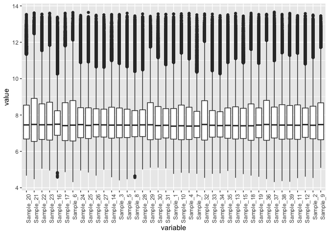

``` r
meltedExpressionMatrix %>% 
  ggplot(aes(x = value, color = variable)) +
  geom_density() +
  theme(axis.text.x = element_text(angle = 90, hjust = 1))
```

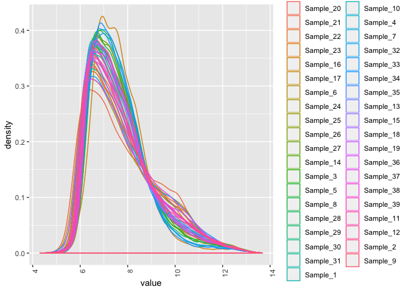

Part 3: Single Gene Analysis
----------------------------

Here, differential gene expression will be looked at at the single gene level.

### What Does Differential Expression Look Like?

Here gene **1429226\_at** will be used as an example.

``` r
geneIds <- c("1416119_at", "1431708_a_at")

expressionDataForGene <- expressionMatrix %>% filter(gene %in% geneIds)

expressionDataForGene <- expressionDataForGene %>%
  as.data.frame() %>% 
  column_to_rownames("gene") %>%
  t() %>% as.data.frame() %>% 
  rownames_to_column("sample_id") %>% 
  melt(id = "sample_id") %>% 
  as_tibble() %>% 
  select(sample_id,
         gene = variable, 
         expression = value)

expressionDataForGene
```

    ## # A tibble: 78 x 3
    ##    sample_id gene       expression
    ##    <chr>     <fct>           <dbl>
    ##  1 Sample_20 1416119_at      10.6 
    ##  2 Sample_21 1416119_at      11   
    ##  3 Sample_22 1416119_at      10.8 
    ##  4 Sample_23 1416119_at      10.9 
    ##  5 Sample_16 1416119_at       9.20
    ##  6 Sample_17 1416119_at      11.0 
    ##  7 Sample_6  1416119_at      10.9 
    ##  8 Sample_24 1416119_at      10.4 
    ##  9 Sample_25 1416119_at      10.6 
    ## 10 Sample_26 1416119_at      10.2 
    ## # … with 68 more rows

Now I will put this data transformation code into a function for later re-use:

``` r
transformGeneExpressionMatrix <- function(expressionMatrix) {
  expressionMatrix <- expressionMatrix %>%
    as.data.frame() %>% 
    column_to_rownames("gene") %>%
    t() %>% as.data.frame() %>% 
    rownames_to_column("sample_id") %>% 
    melt(id = "sample_id") %>% 
    as_tibble() %>% 
    select(sample_id,
           gene = variable, 
           expression = value)
  return(expressionMatrix)
}
```

Using the function:

``` r
expressionDataForGene <- expressionMatrix %>% filter(gene %in% geneIds)

expressionDataForGene
```

    ## # A tibble: 2 x 40
    ##   gene  Sample_20 Sample_21 Sample_22 Sample_23 Sample_16 Sample_17
    ##   <chr>     <dbl>     <dbl>     <dbl>     <dbl>     <dbl>     <dbl>
    ## 1 1416…     10.6       11       10.8      10.9       9.20     11.0 
    ## 2 1431…      9.95      10.1      9.83      9.98      7.73      6.85
    ## # … with 33 more variables: Sample_6 <dbl>, Sample_24 <dbl>,
    ## #   Sample_25 <dbl>, Sample_26 <dbl>, Sample_27 <dbl>, Sample_14 <dbl>,
    ## #   Sample_3 <dbl>, Sample_5 <dbl>, Sample_8 <dbl>, Sample_28 <dbl>,
    ## #   Sample_29 <dbl>, Sample_30 <dbl>, Sample_31 <dbl>, Sample_1 <dbl>,
    ## #   Sample_10 <dbl>, Sample_4 <dbl>, Sample_7 <dbl>, Sample_32 <dbl>,
    ## #   Sample_33 <dbl>, Sample_34 <dbl>, Sample_35 <dbl>, Sample_13 <dbl>,
    ## #   Sample_15 <dbl>, Sample_18 <dbl>, Sample_19 <dbl>, Sample_36 <dbl>,
    ## #   Sample_37 <dbl>, Sample_38 <dbl>, Sample_39 <dbl>, Sample_11 <dbl>,
    ## #   Sample_12 <dbl>, Sample_2 <dbl>, Sample_9 <dbl>

``` r
expressionDataForGene <- transformGeneExpressionMatrix(expressionDataForGene)
expressionDataForGene
```

    ## # A tibble: 78 x 3
    ##    sample_id gene       expression
    ##    <chr>     <fct>           <dbl>
    ##  1 Sample_20 1416119_at      10.6 
    ##  2 Sample_21 1416119_at      11   
    ##  3 Sample_22 1416119_at      10.8 
    ##  4 Sample_23 1416119_at      10.9 
    ##  5 Sample_16 1416119_at       9.20
    ##  6 Sample_17 1416119_at      11.0 
    ##  7 Sample_6  1416119_at      10.9 
    ##  8 Sample_24 1416119_at      10.4 
    ##  9 Sample_25 1416119_at      10.6 
    ## 10 Sample_26 1416119_at      10.2 
    ## # … with 68 more rows

Integrating the samples metadata via a join:

``` r
expressionDataForGene <- expressionDataForGene %>% left_join(samplesMetadata, by = "sample_id")

expressionDataForGene
```

    ## # A tibble: 78 x 6
    ##    sample_id gene       expression sample_number dev_stage genotype
    ##    <chr>     <fct>           <dbl>         <int> <fct>     <fct>   
    ##  1 Sample_20 1416119_at      10.6             20 E16       wt      
    ##  2 Sample_21 1416119_at      11               21 E16       wt      
    ##  3 Sample_22 1416119_at      10.8             22 E16       wt      
    ##  4 Sample_23 1416119_at      10.9             23 E16       wt      
    ##  5 Sample_16 1416119_at       9.20            16 E16       NrlKO   
    ##  6 Sample_17 1416119_at      11.0             17 E16       NrlKO   
    ##  7 Sample_6  1416119_at      10.9              6 E16       NrlKO   
    ##  8 Sample_24 1416119_at      10.4             24 P2        wt      
    ##  9 Sample_25 1416119_at      10.6             25 P2        wt      
    ## 10 Sample_26 1416119_at      10.2             26 P2        wt      
    ## # … with 68 more rows

Now I will visualize the data for a few genes:

``` r
expressionDataForGene %>% 
  ggplot(aes(x = expression, y = genotype, color = genotype)) + 
  geom_point(size = 3, shape = 1) +
  facet_wrap(~gene)
```

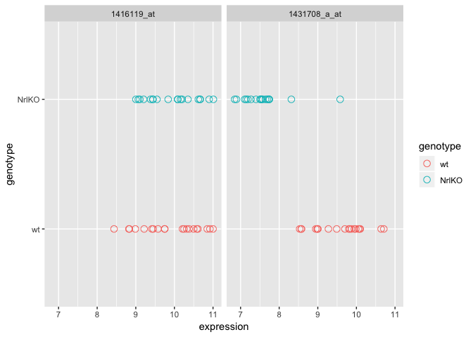

### The Two-Group T-Test:

Comparing the expression values across the two genotypes for the boring gene via a t-test:

``` r
boringGene <- expressionDataForGene %>% filter(gene == "1416119_at")
t.test(expression ~ genotype, boringGene)
```

    ## 
    ##  Welch Two Sample t-test
    ## 
    ## data:  expression by genotype
    ## t = -0.18395, df = 36.534, p-value = 0.8551
    ## alternative hypothesis: true difference in means is not equal to 0
    ## 95 percent confidence interval:
    ##  -0.5079125  0.4233967
    ## sample estimates:
    ##    mean in group wt mean in group NrlKO 
    ##            9.892900            9.935158

The p-value is &gt;0.8 and is not significant.

Comparing the expression values across the two genotypes for the interesting gene via a t-test:

``` r
interestingGene <- expressionDataForGene %>% filter(gene == "1431708_a_at")
t.test(expression ~ genotype, interestingGene)
```

    ## 
    ##  Welch Two Sample t-test
    ## 
    ## data:  expression by genotype
    ## t = 9.838, df = 36.89, p-value = 7.381e-12
    ## alternative hypothesis: true difference in means is not equal to 0
    ## 95 percent confidence interval:
    ##  1.569556 2.383870
    ## sample estimates:
    ##    mean in group wt mean in group NrlKO 
    ##            9.554450            7.577737

The p-value is &lt; 7.381e-12 and is significant.

### The Mighty Linear Regression:

``` r
boringGene <- expressionDataForGene %>% filter(gene == "1416119_at")
summary(lm(expression ~ genotype, boringGene))
```

    ## 
    ## Call:
    ## lm(formula = expression ~ genotype, data = boringGene)
    ## 
    ## Residuals:
    ##     Min      1Q  Median      3Q     Max 
    ## -1.4559 -0.5257  0.1448  0.6460  1.1071 
    ## 
    ## Coefficients:
    ##               Estimate Std. Error t value Pr(>|t|)    
    ## (Intercept)    9.89290    0.16104  61.432   <2e-16 ***
    ## genotypeNrlKO  0.04226    0.23072   0.183    0.856    
    ## ---
    ## Signif. codes:  0 '***' 0.001 '**' 0.01 '*' 0.05 '.' 0.1 ' ' 1
    ## 
    ## Residual standard error: 0.7202 on 37 degrees of freedom
    ## Multiple R-squared:  0.0009058,  Adjusted R-squared:  -0.0261 
    ## F-statistic: 0.03355 on 1 and 37 DF,  p-value: 0.8557

The same p-value is acheived.

``` r
interestingGene <- expressionDataForGene %>% filter(gene == "1431708_a_at")
summary(lm(expression ~ genotype, interestingGene))
```

    ## 
    ## Call:
    ## lm(formula = expression ~ genotype, data = interestingGene)
    ## 
    ## Residuals:
    ##      Min       1Q   Median       3Q      Max 
    ## -1.02445 -0.45124 -0.03874  0.29605  2.00126 
    ## 
    ## Coefficients:
    ##               Estimate Std. Error t value Pr(>|t|)    
    ## (Intercept)     9.5545     0.1406   67.94  < 2e-16 ***
    ## genotypeNrlKO  -1.9767     0.2015   -9.81 7.71e-12 ***
    ## ---
    ## Signif. codes:  0 '***' 0.001 '**' 0.01 '*' 0.05 '.' 0.1 ' ' 1
    ## 
    ## Residual standard error: 0.629 on 37 degrees of freedom
    ## Multiple R-squared:  0.7223, Adjusted R-squared:  0.7148 
    ## F-statistic: 96.24 on 1 and 37 DF,  p-value: 7.713e-12

The same p-value is acheived.

I will now run an ANOVA analysis:

``` r
interestingGene <- expressionDataForGene %>% filter(gene == "1431708_a_at")
summary(aov(expression ~ dev_stage, interestingGene))
```

    ##             Df Sum Sq Mean Sq F value Pr(>F)
    ## dev_stage    4   2.75  0.6868   0.467  0.759
    ## Residuals   34  49.96  1.4695

Comparing the ANOVA test with the linear model:

``` r
interestingGene <- expressionDataForGene %>% filter(gene == "1431708_a_at")
summary(lm(expression ~ dev_stage, interestingGene))
```

    ## 
    ## Call:
    ## lm(formula = expression ~ dev_stage, data = interestingGene)
    ## 
    ## Residuals:
    ##     Min      1Q  Median      3Q     Max 
    ## -1.9236 -0.8776  0.2208  0.9687  2.2898 
    ## 
    ## Coefficients:
    ##                  Estimate Std. Error t value Pr(>|t|)    
    ## (Intercept)        8.7613     0.4582  19.122   <2e-16 ***
    ## dev_stageP2       -0.4024     0.6274  -0.641    0.526    
    ## dev_stageP6       -0.4110     0.6274  -0.655    0.517    
    ## dev_stageP10      -0.2839     0.6274  -0.453    0.654    
    ## dev_stage4_weeks   0.2693     0.6274   0.429    0.670    
    ## ---
    ## Signif. codes:  0 '***' 0.001 '**' 0.01 '*' 0.05 '.' 0.1 ' ' 1
    ## 
    ## Residual standard error: 1.212 on 34 degrees of freedom
    ## Multiple R-squared:  0.05212,    Adjusted R-squared:  -0.0594 
    ## F-statistic: 0.4674 on 4 and 34 DF,  p-value: 0.7592

The same p-value for the F-statistics is achieved.

Part 4: Analyzing Lots of Genes - The High Dimensional Approach
---------------------------------------------------------------

Here, differential gene expression will be looked at multiple genes (high dimensional data).

### Bad Variance Estimates:

Here is a data simulation experiment illustrating why gene variance estimates are bad in gene expression data:

``` r
numberOfGenes <- 1000
numberOfSamples <- 3

simulatedGeneExpressionMatrix <- matrix(rnorm(numberOfGenes * numberOfSamples), nrow = numberOfGenes) 
simulatedGeneExpressionMatrix %>% head()
```

    ##            [,1]        [,2]          [,3]
    ## [1,] -0.4049852 -0.40711787 -0.8531334501
    ## [2,]  0.7005066 -1.17684109  0.5562214093
    ## [3,] -1.3583118 -0.59964802 -0.0006655498
    ## [4,] -1.1006955 -0.66540573 -0.0804847532
    ## [5,] -0.8466647  0.04783976  0.0107842697
    ## [6,]  0.3767273  1.53635539 -1.8342400856

``` r
geneVars <- simulatedGeneExpressionMatrix %>% apply(1, var)

tibble(variance = geneVars) %>% 
  ggplot(aes(x = variance)) + 
  geom_density() +
  geom_point(aes(y = 0), shape = 1, size = 3)
```

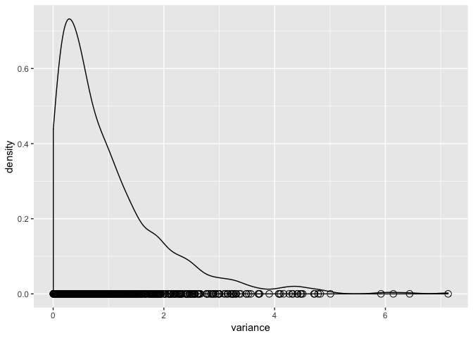

Limma fixes this problem by using moderated t-values where the "typical variance" is used to weight gene-specific variance estimates.

### Limma in Action:

Using limma for large-scale differential expression analysis:

``` r
wildTypeSamples <- samplesMetadata %>% filter(genotype == "wt")

wildTypeSamples
```

    ## # A tibble: 20 x 4
    ##    sample_id sample_number dev_stage genotype
    ##    <chr>             <int> <fct>     <fct>   
    ##  1 Sample_20            20 E16       wt      
    ##  2 Sample_21            21 E16       wt      
    ##  3 Sample_22            22 E16       wt      
    ##  4 Sample_23            23 E16       wt      
    ##  5 Sample_24            24 P2        wt      
    ##  6 Sample_25            25 P2        wt      
    ##  7 Sample_26            26 P2        wt      
    ##  8 Sample_27            27 P2        wt      
    ##  9 Sample_28            28 P6        wt      
    ## 10 Sample_29            29 P6        wt      
    ## 11 Sample_30            30 P6        wt      
    ## 12 Sample_31            31 P6        wt      
    ## 13 Sample_32            32 P10       wt      
    ## 14 Sample_33            33 P10       wt      
    ## 15 Sample_34            34 P10       wt      
    ## 16 Sample_35            35 P10       wt      
    ## 17 Sample_36            36 4_weeks   wt      
    ## 18 Sample_37            37 4_weeks   wt      
    ## 19 Sample_38            38 4_weeks   wt      
    ## 20 Sample_39            39 4_weeks   wt

Here I create a function for pulling expression data for given samples:

``` r
getExpressionForSamples <- function(sampleIds, expressionMatrix) {
  dataFrame <- expressionMatrix %>% 
    as.data.frame() %>% 
    column_to_rownames("gene")
  return(dataFrame[sampleIds])
}

wildTypeExpressionMatrix <- getExpressionForSamples(wildTypeSamples$sample_id, expressionMatrix)

wildTypeExpressionMatrix %>% as_tibble()
```

    ## # A tibble: 29,949 x 20
    ##    Sample_20 Sample_21 Sample_22 Sample_23 Sample_24 Sample_25 Sample_26
    ##        <dbl>     <dbl>     <dbl>     <dbl>     <dbl>     <dbl>     <dbl>
    ##  1      7.24      7.41      7.17      7.07      7.11      7.19      7.18
    ##  2      9.48     10.0       9.85     10.1       9.75      9.16      9.49
    ##  3     10.0      10.0       9.91      9.91      9.39     10.1       9.41
    ##  4      8.36      8.37      8.40      8.49      8.37      8.20      8.73
    ##  5      8.59      8.62      8.52      8.64      8.36      8.50      8.39
    ##  6      9.59      9.72      9.71      9.7       9.64      9.65      9.87
    ##  7      9.68     10.4       9.87     10.2       9.15      8.18      9.10
    ##  8      7.24      7.90      7.48      7.49      7.19      7.23      7.06
    ##  9     11.7      11.5      11.5      11.6      11.4      11.3      11.8 
    ## 10      9.21     10.1       9.82      9.92      9.30      9.94      8.77
    ## # … with 29,939 more rows, and 13 more variables: Sample_27 <dbl>,
    ## #   Sample_28 <dbl>, Sample_29 <dbl>, Sample_30 <dbl>, Sample_31 <dbl>,
    ## #   Sample_32 <dbl>, Sample_33 <dbl>, Sample_34 <dbl>, Sample_35 <dbl>,
    ## #   Sample_36 <dbl>, Sample_37 <dbl>, Sample_38 <dbl>, Sample_39 <dbl>

Confirming that the samples are ordered identically in the samples metadata data frame as well as the expression matrix:

``` r
wildTypeSamples$sample_id
```

    ##  [1] "Sample_20" "Sample_21" "Sample_22" "Sample_23" "Sample_24"
    ##  [6] "Sample_25" "Sample_26" "Sample_27" "Sample_28" "Sample_29"
    ## [11] "Sample_30" "Sample_31" "Sample_32" "Sample_33" "Sample_34"
    ## [16] "Sample_35" "Sample_36" "Sample_37" "Sample_38" "Sample_39"

``` r
names(wildTypeExpressionMatrix)
```

    ##  [1] "Sample_20" "Sample_21" "Sample_22" "Sample_23" "Sample_24"
    ##  [6] "Sample_25" "Sample_26" "Sample_27" "Sample_28" "Sample_29"
    ## [11] "Sample_30" "Sample_31" "Sample_32" "Sample_33" "Sample_34"
    ## [16] "Sample_35" "Sample_36" "Sample_37" "Sample_38" "Sample_39"

``` r
(wildTypeSamples$sample_id == names(wildTypeExpressionMatrix)) %>% all()
```

    ## [1] TRUE

Constructing the design matrix:

``` r
designMatrix <- model.matrix(~dev_stage, wildTypeSamples)
head(designMatrix, 10) %>% kable()
```

|  (Intercept)|  dev\_stageP2|  dev\_stageP6|  dev\_stageP10|  dev\_stage4\_weeks|
|------------:|-------------:|-------------:|--------------:|-------------------:|
|            1|             0|             0|              0|                   0|
|            1|             0|             0|              0|                   0|
|            1|             0|             0|              0|                   0|
|            1|             0|             0|              0|                   0|
|            1|             1|             0|              0|                   0|
|            1|             1|             0|              0|                   0|
|            1|             1|             0|              0|                   0|
|            1|             1|             0|              0|                   0|
|            1|             0|             1|              0|                   0|
|            1|             0|             1|              0|                   0|

``` r
head(wildTypeSamples, 10) %>% kable()
```

| sample\_id |  sample\_number| dev\_stage | genotype |
|:-----------|---------------:|:-----------|:---------|
| Sample\_20 |              20| E16        | wt       |
| Sample\_21 |              21| E16        | wt       |
| Sample\_22 |              22| E16        | wt       |
| Sample\_23 |              23| E16        | wt       |
| Sample\_24 |              24| P2         | wt       |
| Sample\_25 |              25| P2         | wt       |
| Sample\_26 |              26| P2         | wt       |
| Sample\_27 |              27| P2         | wt       |
| Sample\_28 |              28| P6         | wt       |
| Sample\_29 |              29| P6         | wt       |

Fitting the model:

``` r
wildTypeDevStageFit <- lmFit(wildTypeExpressionMatrix, designMatrix)

wildTypeDevStageFitEb <- eBayes(wildTypeDevStageFit)
```

### The topTable() Function:

Now I will use the topTable() function to go through the differentially expressed genes list:

``` r
topTenGenes <- topTable(wildTypeDevStageFitEb)
```

    ## Removing intercept from test coefficients

``` r
topTenGenes
```

    ##              dev_stageP2 dev_stageP6 dev_stageP10 dev_stage4_weeks AveExpr
    ## 1440645_at       0.39900     0.19525      0.92000          3.96125 6.52835
    ## 1416041_at       0.15800     0.47975      0.33275          5.11450 9.38250
    ## 1425222_x_at     0.88200     0.79950      1.54875          5.53175 7.02815
    ## 1451635_at       1.30250     1.19000      2.01600          6.18825 8.31860
    ## 1429028_at      -2.44325    -3.40725     -4.31050         -4.60175 8.04495
    ## 1422929_s_at    -2.91175    -3.61825     -3.54725         -3.66125 7.27830
    ## 1424852_at       0.45750     0.22975      0.57400          3.97900 7.45405
    ## 1425171_at       0.99800     3.05300      5.27875          6.07875 9.62045
    ## 1451617_at       0.72550     2.51275      4.98375          6.68475 8.81660
    ## 1451618_at       0.60275     2.89025      5.05075          6.28825 9.43065
    ##                     F      P.Value    adj.P.Val
    ## 1440645_at   425.4464 1.587779e-17 4.755241e-13
    ## 1416041_at   195.4574 1.522363e-14 2.279662e-10
    ## 1425222_x_at 173.3572 4.348283e-14 4.340891e-10
    ## 1451635_at   157.3341 1.013031e-13 7.584816e-10
    ## 1429028_at   148.7971 1.645967e-13 9.202951e-10
    ## 1422929_s_at 146.8672 1.843725e-13 9.202951e-10
    ## 1424852_at   143.2443 2.290408e-13 9.799345e-10
    ## 1425171_at   138.8483 3.001762e-13 1.123747e-09
    ## 1451617_at   136.4774 3.485203e-13 1.159759e-09
    ## 1451618_at   134.2025 4.031647e-13 1.207438e-09

Plotting the top 6 genes in the list:

``` r
topGenes <- rownames(topTenGenes)[1:6]
topGenesExpressionData <- wildTypeExpressionMatrix %>% 
  rownames_to_column("gene") %>% 
  filter(gene %in% topGenes) %>%
  transformGeneExpressionMatrix() %>% 
  left_join(wildTypeSamples, id = "sample_id")
```

    ## Joining, by = "sample_id"

``` r
topGenesExpressionData
```

    ## # A tibble: 120 x 6
    ##    sample_id gene       expression sample_number dev_stage genotype
    ##    <chr>     <fct>           <dbl>         <int> <fct>     <fct>   
    ##  1 Sample_20 1416041_at       8.48            20 E16       wt      
    ##  2 Sample_21 1416041_at       7.74            21 E16       wt      
    ##  3 Sample_22 1416041_at       8.29            22 E16       wt      
    ##  4 Sample_23 1416041_at       8.15            23 E16       wt      
    ##  5 Sample_24 1416041_at       8.17            24 P2        wt      
    ##  6 Sample_25 1416041_at       8.66            25 P2        wt      
    ##  7 Sample_26 1416041_at       8.11            26 P2        wt      
    ##  8 Sample_27 1416041_at       8.35            27 P2        wt      
    ##  9 Sample_28 1416041_at       8.40            28 P6        wt      
    ## 10 Sample_29 1416041_at       8.37            29 P6        wt      
    ## # … with 110 more rows

``` r
topGenesExpressionData %>% 
  ggplot(aes(x = dev_stage, y = expression, color = genotype)) +
  geom_point() +
  geom_jitter() +
  stat_summary(aes(y = expression, group=1), fun.y = mean, geom="line") +
  facet_wrap(~gene)
```

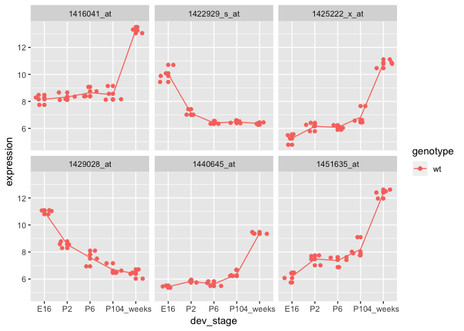

Putting the graphing code into a reusable function and verifying that the function works:

``` r
plotGenes <- function(genes, expressionMatrix, samplesMetadata) {
  
  expressionDataForGenes <- expressionMatrix %>% 
    rownames_to_column("gene") %>% 
    filter(gene %in% genes) %>%
    transformGeneExpressionMatrix() %>% 
    left_join(samplesMetadata, id = "sample_id")
  
  expressionDataForGenes %>% 
    ggplot(aes(x = dev_stage, y = expression, color = genotype)) +
    geom_point() +
    geom_jitter() +
    stat_summary(aes(y = expression, group=1), fun.y = mean, geom="line") +
    facet_wrap(~gene)
}

plotGenes(topGenes, wildTypeExpressionMatrix, wildTypeSamples)
```

    ## Joining, by = "sample_id"

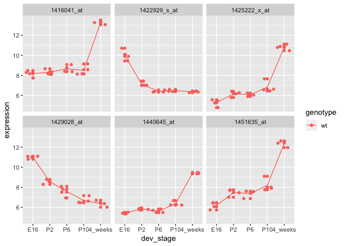

Using topTable() to find insignificant genes:

``` r
allGenes <- topTable(wildTypeDevStageFitEb, number = Inf)
```

    ## Removing intercept from test coefficients

``` r
nrow(allGenes)
```

    ## [1] 29949

``` r
boringGeneIndices <- seq(from = nrow(allGenes), to = nrow(allGenes) - 5)

boringGenes <- allGenes[boringGeneIndices,] 

boringGenes
```

    ##              dev_stageP2 dev_stageP6 dev_stageP10 dev_stage4_weeks AveExpr
    ## 1436053_at      -0.00175    -0.00850     -0.00925         -0.00500 7.61335
    ## 1441195_at       0.01450     0.01400     -0.01475         -0.00750 7.68300
    ## 1431188_a_at     0.00575     0.02725      0.00875          0.00125 6.94585
    ## 1418235_at       0.00075    -0.00700      0.03500         -0.01500 6.44150
    ## 1416378_at       0.03650    -0.00075      0.01500         -0.00825 6.71775
    ## 1452600_at      -0.02575    -0.01750     -0.00575         -0.03150 6.20265
    ##                        F   P.Value adj.P.Val
    ## 1436053_at   0.002772688 0.9999830 0.9999830
    ## 1441195_at   0.015007091 0.9995115 0.9995449
    ## 1431188_a_at 0.023344402 0.9988338 0.9989005
    ## 1418235_at   0.023367662 0.9988315 0.9989005
    ## 1416378_at   0.024051269 0.9987635 0.9988969
    ## 1452600_at   0.027650520 0.9983752 0.9985419

Plotting these insignificant genes:

``` r
plotGenes(rownames(boringGenes), wildTypeExpressionMatrix, wildTypeSamples)
```

    ## Joining, by = "sample_id"

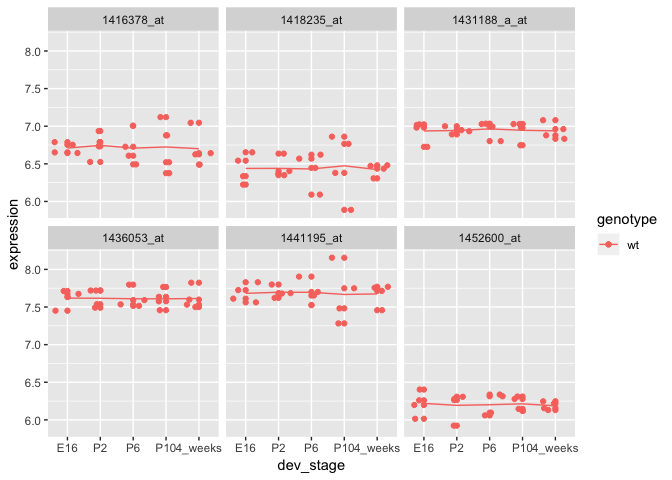

### Constructing and Using the Contrast Matrix:

Everything previously assessed was done relative to the baseline (E16).

However, I will now explore what to do if I am particularly interested in finding the genes that are differentially expressed from developmental stages P6 to P10? Or from P10 to 4\_weeks? Or both?

Here I will distinguish genes that have stable expression at the last three developmental stages (P6, P10, and 4\_weeks) from those that do not.

``` r
contrastMatrix <- makeContrasts(
  p10vsp6 = dev_stageP10 - dev_stageP6,
  fourweeksVsP10 = dev_stage4_weeks - dev_stageP10,
  levels = designMatrix
)
```

    ## Warning in makeContrasts(p10vsp6 = dev_stageP10 - dev_stageP6,
    ## fourweeksVsP10 = dev_stage4_weeks - : Renaming (Intercept) to Intercept

``` r
contrastMatrix
```

    ##                   Contrasts
    ## Levels             p10vsp6 fourweeksVsP10
    ##   Intercept              0              0
    ##   dev_stageP2            0              0
    ##   dev_stageP6           -1              0
    ##   dev_stageP10           1             -1
    ##   dev_stage4_weeks       0              1

``` r
contrastFit <- contrasts.fit(wildTypeDevStageFit, contrastMatrix)
```

    ## Warning in contrasts.fit(wildTypeDevStageFit, contrastMatrix): row names of
    ## contrasts don't match col names of coefficients

``` r
contrastFitEb <- eBayes(contrastFit)
```

Running topTable() will get the results:

``` r
contrastGenes <- topTable(contrastFitEb)

contrastGenes
```

    ##               p10vsp6 fourweeksVsP10 AveExpr        F      P.Value
    ## 1440645_at    0.72475        3.04125 6.52835 632.7410 2.224325e-17
    ## 1416041_at   -0.14700        4.78175 9.38250 302.3940 1.472973e-14
    ## 1425222_x_at  0.74925        3.98300 7.02815 235.3682 1.299509e-13
    ## 1424852_at    0.34425        3.40500 7.45405 225.1087 1.910320e-13
    ## 1420726_x_at  0.17325        3.55125 7.19000 203.5215 4.555385e-13
    ## 1451635_at    0.82600        4.17225 8.31860 200.0177 5.289072e-13
    ## 1429394_at   -0.09800        2.40975 7.84825 167.4991 2.416043e-12
    ## 1455447_at   -0.97650       -1.79975 9.97295 153.5444 5.063369e-12
    ## 1429791_at    0.24800        1.65825 8.02555 145.7407 7.877494e-12
    ## 1422612_at    0.48375        3.42600 8.83255 142.2388 9.676005e-12
    ##                 adj.P.Val
    ## 1440645_at   6.661631e-13
    ## 1416041_at   2.205703e-10
    ## 1425222_x_at 1.297300e-09
    ## 1424852_at   1.430304e-09
    ## 1420726_x_at 2.640040e-09
    ## 1451635_at   2.640040e-09
    ## 1429394_at   1.033687e-08
    ## 1455447_at   1.895536e-08
    ## 1429791_at   2.621367e-08
    ## 1422612_at   2.840295e-08

Plotting the top 6 genes:

``` r
plotGenes(rownames(contrastGenes)[1:6], wildTypeExpressionMatrix, wildTypeSamples)
```

    ## Joining, by = "sample_id"

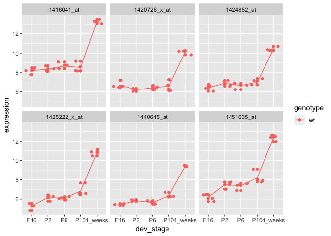

To find some genes where there’s a change in each case but in the opposite direction the decideTests() function will be used to adjust the p-values for both contrasts globally:

``` r
cutoff <- 1e-04
wtResCont <- decideTests(contrastFitEb, p.value = cutoff, method = "global")
summary(wtResCont)
```

    ##        p10vsp6 fourweeksVsP10
    ## Down         4              8
    ## NotSig   29945          29895
    ## Up           0             46

From this analysis we can see that there are 4 probes that go down from P6 to P10 and no hits going the other way. There are 8 probes that go down from P10 to 4\_weeks and 46 going the other way.

Plotting the 4 that decline from P6 to P10:

``` r
hits1 <- wtResCont %>% 
  as.data.frame() %>% 
  rownames_to_column("gene") %>% 
  filter(p10vsp6 < 0)

hits1
```

    ##         gene p10vsp6 fourweeksVsP10
    ## 1 1416635_at      -1              0
    ## 2 1437781_at      -1              0
    ## 3 1454752_at      -1              0
    ## 4 1455260_at      -1              0

``` r
plotGenes(hits1$gene, wildTypeExpressionMatrix, wildTypeSamples)
```

    ## Joining, by = "sample_id"

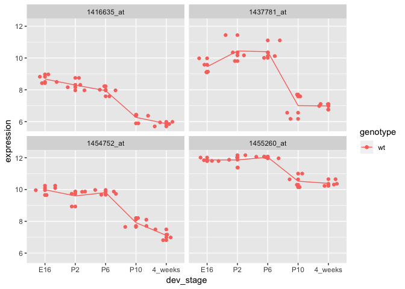

Plotting 4 of the 8 that decline from P10 to 4\_weeks:

``` r
hits2 <- wtResCont %>% 
  as.data.frame() %>% 
  rownames_to_column("gene") %>% 
  filter(fourweeksVsP10 < 0)

hits2
```

    ##           gene p10vsp6 fourweeksVsP10
    ## 1 1416021_a_at       0             -1
    ## 2 1423851_a_at       0             -1
    ## 3   1434500_at       0             -1
    ## 4 1435415_x_at       0             -1
    ## 5 1437502_x_at       0             -1
    ## 6 1448182_a_at       0             -1
    ## 7   1452679_at       0             -1
    ## 8   1455447_at       0             -1

``` r
plotGenes(hits2$gene[1:4], wildTypeExpressionMatrix, wildTypeSamples)
```

    ## Joining, by = "sample_id"

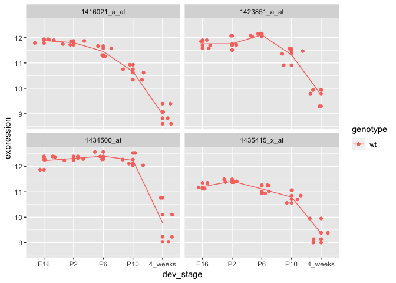

Testing to see if there is overlap between the probes:

``` r
hits1$gene %>% intersect(hits2$gene)
```

    ## character(0)

There is no overlap.

### Assessing Interaction:

Now I will take into account both genotypes to test if the effect of developmental stages is different for the two genotypes.

To test this interaction, all samples need to be analyzed together:

``` r
interactionSamples <- samplesMetadata %>% filter(dev_stage %in% c("E16", "4_weeks"))

interactionSamples$dev_stage <- interactionSamples$dev_stage %>% 
  as.character() %>% 
  factor(levels = c("E16", "4_weeks"))

interactionSamples
```

    ## # A tibble: 15 x 4
    ##    sample_id sample_number dev_stage genotype
    ##    <chr>             <int> <fct>     <fct>   
    ##  1 Sample_20            20 E16       wt      
    ##  2 Sample_21            21 E16       wt      
    ##  3 Sample_22            22 E16       wt      
    ##  4 Sample_23            23 E16       wt      
    ##  5 Sample_16            16 E16       NrlKO   
    ##  6 Sample_17            17 E16       NrlKO   
    ##  7 Sample_6              6 E16       NrlKO   
    ##  8 Sample_36            36 4_weeks   wt      
    ##  9 Sample_37            37 4_weeks   wt      
    ## 10 Sample_38            38 4_weeks   wt      
    ## 11 Sample_39            39 4_weeks   wt      
    ## 12 Sample_11            11 4_weeks   NrlKO   
    ## 13 Sample_12            12 4_weeks   NrlKO   
    ## 14 Sample_2              2 4_weeks   NrlKO   
    ## 15 Sample_9              9 4_weeks   NrlKO

``` r
expressionMatrix
```

    ## # A tibble: 29,949 x 40
    ##    gene  Sample_20 Sample_21 Sample_22 Sample_23 Sample_16 Sample_17
    ##    <chr>     <dbl>     <dbl>     <dbl>     <dbl>     <dbl>     <dbl>
    ##  1 1415…      7.24      7.41      7.17      7.07      7.38      7.34
    ##  2 1415…      9.48     10.0       9.85     10.1       7.64     10.0 
    ##  3 1415…     10.0      10.0       9.91      9.91      8.42     10.2 
    ##  4 1415…      8.36      8.37      8.40      8.49      8.36      8.37
    ##  5 1415…      8.59      8.62      8.52      8.64      8.51      8.89
    ##  6 1415…      9.59      9.72      9.71      9.7       9.66      9.61
    ##  7 1415…      9.68     10.4       9.87     10.2       8.04     10.0 
    ##  8 1415…      7.24      7.90      7.48      7.49      7.34      7.34
    ##  9 1415…     11.7      11.5      11.5      11.6      10.5      11.8 
    ## 10 1415…      9.21     10.1       9.82      9.92      8.22      9.60
    ## # … with 29,939 more rows, and 33 more variables: Sample_6 <dbl>,
    ## #   Sample_24 <dbl>, Sample_25 <dbl>, Sample_26 <dbl>, Sample_27 <dbl>,
    ## #   Sample_14 <dbl>, Sample_3 <dbl>, Sample_5 <dbl>, Sample_8 <dbl>,
    ## #   Sample_28 <dbl>, Sample_29 <dbl>, Sample_30 <dbl>, Sample_31 <dbl>,
    ## #   Sample_1 <dbl>, Sample_10 <dbl>, Sample_4 <dbl>, Sample_7 <dbl>,
    ## #   Sample_32 <dbl>, Sample_33 <dbl>, Sample_34 <dbl>, Sample_35 <dbl>,
    ## #   Sample_13 <dbl>, Sample_15 <dbl>, Sample_18 <dbl>, Sample_19 <dbl>,
    ## #   Sample_36 <dbl>, Sample_37 <dbl>, Sample_38 <dbl>, Sample_39 <dbl>,
    ## #   Sample_11 <dbl>, Sample_12 <dbl>, Sample_2 <dbl>, Sample_9 <dbl>

``` r
expressionDataForInteractionSamples <- getExpressionForSamples(interactionSamples$sample_id, expressionMatrix)
head(expressionDataForInteractionSamples)
```

    ##              Sample_20 Sample_21 Sample_22 Sample_23 Sample_16 Sample_17
    ## 1415670_at       7.236     7.414     7.169     7.070     7.383     7.337
    ## 1415671_at       9.478    10.020     9.854    10.130     7.637    10.030
    ## 1415672_at      10.010    10.040     9.913     9.907     8.423    10.240
    ## 1415673_at       8.362     8.374     8.404     8.487     8.363     8.371
    ## 1415674_a_at     8.585     8.615     8.520     8.641     8.509     8.893
    ## 1415675_at       9.591     9.719     9.709     9.700     9.656     9.614
    ##              Sample_6 Sample_36 Sample_37 Sample_38 Sample_39 Sample_11
    ## 1415670_at      7.240     7.250     7.035     7.374     7.131     7.421
    ## 1415671_at      9.709     9.664     8.381     9.436     8.730     9.831
    ## 1415672_at     10.170     9.514     9.206     9.485     9.526    10.000
    ## 1415673_at      8.835     8.491     8.754     8.495     8.647     8.595
    ## 1415674_a_at    8.542     8.419     8.257     8.339     8.283     8.427
    ## 1415675_at      9.672     9.669     9.547     9.327     9.454     9.598
    ##              Sample_12 Sample_2 Sample_9
    ## 1415670_at       7.109    7.351    7.322
    ## 1415671_at       9.714    9.658    9.798
    ## 1415672_at       9.429    9.914    9.847
    ## 1415673_at       8.427    8.404    8.404
    ## 1415674_a_at     8.498    8.373    8.458
    ## 1415675_at       9.740    9.455    9.508

``` r
interactionDesign <- model.matrix(~genotype*dev_stage, interactionSamples)

interactionDesign
```

    ##    (Intercept) genotypeNrlKO dev_stage4_weeks
    ## 1            1             0                0
    ## 2            1             0                0
    ## 3            1             0                0
    ## 4            1             0                0
    ## 5            1             1                0
    ## 6            1             1                0
    ## 7            1             1                0
    ## 8            1             0                1
    ## 9            1             0                1
    ## 10           1             0                1
    ## 11           1             0                1
    ## 12           1             1                1
    ## 13           1             1                1
    ## 14           1             1                1
    ## 15           1             1                1
    ##    genotypeNrlKO:dev_stage4_weeks
    ## 1                               0
    ## 2                               0
    ## 3                               0
    ## 4                               0
    ## 5                               0
    ## 6                               0
    ## 7                               0
    ## 8                               0
    ## 9                               0
    ## 10                              0
    ## 11                              0
    ## 12                              1
    ## 13                              1
    ## 14                              1
    ## 15                              1
    ## attr(,"assign")
    ## [1] 0 1 2 3
    ## attr(,"contrasts")
    ## attr(,"contrasts")$genotype
    ## [1] "contr.treatment"
    ## 
    ## attr(,"contrasts")$dev_stage
    ## [1] "contr.treatment"

Now I have a design that allows for the comparison of the effect development stage for the two genotypes. Here the baseline is wildtype at the E16 developmental stage.

Finally, I will identifying genes that are upregulated over development for one genotype but down regulated for the other (i.e. genes supporting an interactive effect between genotype and developmental stage):

``` r
interactionFit <- lmFit(expressionDataForInteractionSamples, interactionDesign) %>% eBayes()

cutoff <- 1e-06
changeDirections <- decideTests(interactionFit, p.value = cutoff, method = "global") %>% 
  as.data.frame() %>% 
  rownames_to_column("gene") %>% 
  as_tibble()

hits <- changeDirections %>% filter(dev_stage4_weeks < 0, `genotypeNrlKO:dev_stage4_weeks` > 0)

expressionDataForHits <- expressionDataForInteractionSamples %>% 
  rownames_to_column("gene") %>% 
  filter(gene %in% hits$gene[1:4]) %>%
  transformGeneExpressionMatrix() %>% 
  left_join(samplesMetadata, id = "sample_id")
```

    ## Joining, by = "sample_id"

``` r
expressionDataForHits$dev_stage <- expressionDataForHits$dev_stage %>% as.numeric()

expressionDataForHits %>%
  ggplot(aes(x = dev_stage, y = expression, color = genotype)) +
  geom_point() +
  geom_jitter() +
  geom_smooth(method = "lm", se = FALSE) +
  facet_wrap(~gene)
```

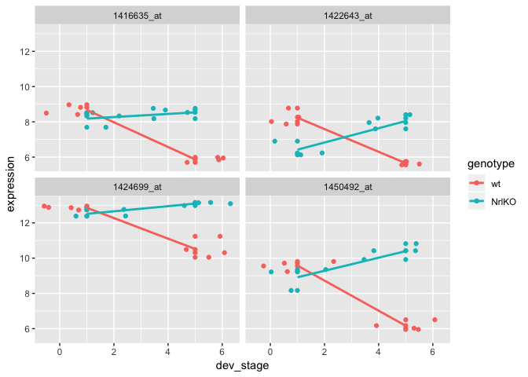

Part 5: Deliverables
====================

For this deliverable I will make a similar plot as seen above, this time identifying 4 genes that demonstrate no interaction between genotype and developmental stages:

``` r
interactionFit <- lmFit(expressionDataForInteractionSamples, interactionDesign) %>% eBayes()

cutoff <- 0.90
sameDirections <- decideTests(interactionFit, p.value = cutoff, method = "global") %>% 
  as.data.frame() %>% 
  rownames_to_column("gene") %>% 
  as_tibble()
 
hits <- sameDirections %>% filter(dev_stage4_weeks > 0, `genotypeNrlKO:dev_stage4_weeks` > 0)

expressionDataForHits <- expressionDataForInteractionSamples %>% 
  rownames_to_column("gene") %>% 
  filter(gene %in% hits$gene[1:4]) %>%
  transformGeneExpressionMatrix() %>% 
  left_join(samplesMetadata, id = "sample_id")
```

    ## Joining, by = "sample_id"

``` r
expressionDataForHits$dev_stage <- expressionDataForHits$dev_stage %>% as.numeric()

expressionDataForHits %>%
  ggplot(aes(x = dev_stage, y = expression, color = genotype)) +
  geom_point() +
  geom_jitter() +
  geom_smooth(method = "lm", se = FALSE) +
  facet_wrap(~gene)
```

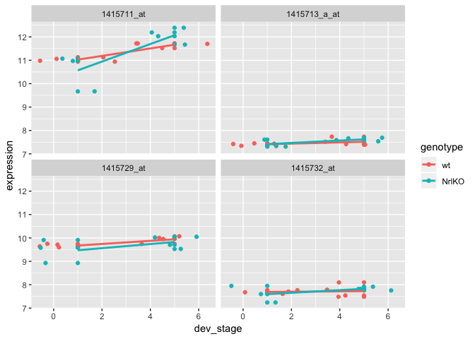

As shown above, the presented four genes demonstrate no interaction between genotype and developmental stage.
