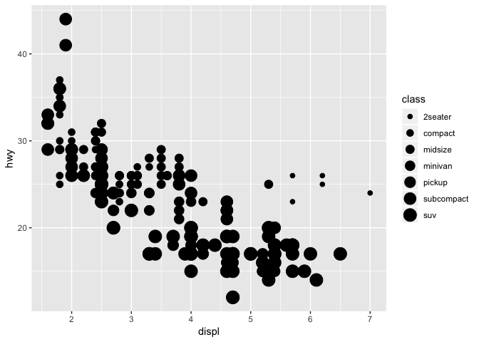
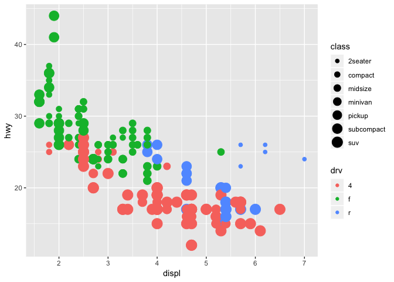

STAT 540 Seminar 2B
================
Matthew Shannon
2019-01-16

Seminar 2b
==========

``` r
library(tidyverse)
```

    ## ── Attaching packages ─────────────────────────────────────────────────────────── tidyverse 1.2.1 ──

    ## ✔ ggplot2 3.1.0     ✔ purrr   0.2.5
    ## ✔ tibble  2.0.1     ✔ dplyr   0.7.8
    ## ✔ tidyr   0.8.2     ✔ stringr 1.3.1
    ## ✔ readr   1.3.1     ✔ forcats 0.3.0

    ## ── Conflicts ────────────────────────────────────────────────────────────── tidyverse_conflicts() ──
    ## ✖ dplyr::filter() masks stats::filter()
    ## ✖ dplyr::lag()    masks stats::lag()

``` r
library(ggplot2)
```

To practice graphing in ggplot2, the **mpg** data frame was explored.

This data frame was loaded by running the following:

``` r
mpg
```

    ## # A tibble: 234 x 11
    ##    manufacturer model displ  year   cyl trans drv     cty   hwy fl    class
    ##    <chr>        <chr> <dbl> <int> <int> <chr> <chr> <int> <int> <chr> <chr>
    ##  1 audi         a4      1.8  1999     4 auto… f        18    29 p     comp…
    ##  2 audi         a4      1.8  1999     4 manu… f        21    29 p     comp…
    ##  3 audi         a4      2    2008     4 manu… f        20    31 p     comp…
    ##  4 audi         a4      2    2008     4 auto… f        21    30 p     comp…
    ##  5 audi         a4      2.8  1999     6 auto… f        16    26 p     comp…
    ##  6 audi         a4      2.8  1999     6 manu… f        18    26 p     comp…
    ##  7 audi         a4      3.1  2008     6 auto… f        18    27 p     comp…
    ##  8 audi         a4 q…   1.8  1999     4 manu… 4        18    26 p     comp…
    ##  9 audi         a4 q…   1.8  1999     4 auto… 4        16    25 p     comp…
    ## 10 audi         a4 q…   2    2008     4 manu… 4        20    28 p     comp…
    ## # … with 224 more rows

Next, a preliminary graph was made from the data:

``` r
ggplot(data = mpg) + 
  geom_point(mapping = aes(x = displ, y = hwy, size = class))
```

    ## Warning: Using size for a discrete variable is not advised.



Finally, to complete the deliverable for this seminar, the above graph was modified to add colour and appear identical to the provided visual that needed to be replicated.

``` r
ggplot(data = mpg) + 
  geom_point(mapping = aes(x = displ, y = hwy, size = class, colour = drv))
```

    ## Warning: Using size for a discrete variable is not advised.


